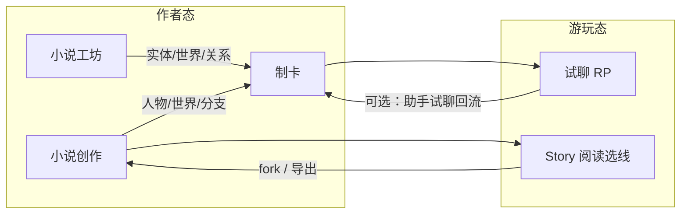
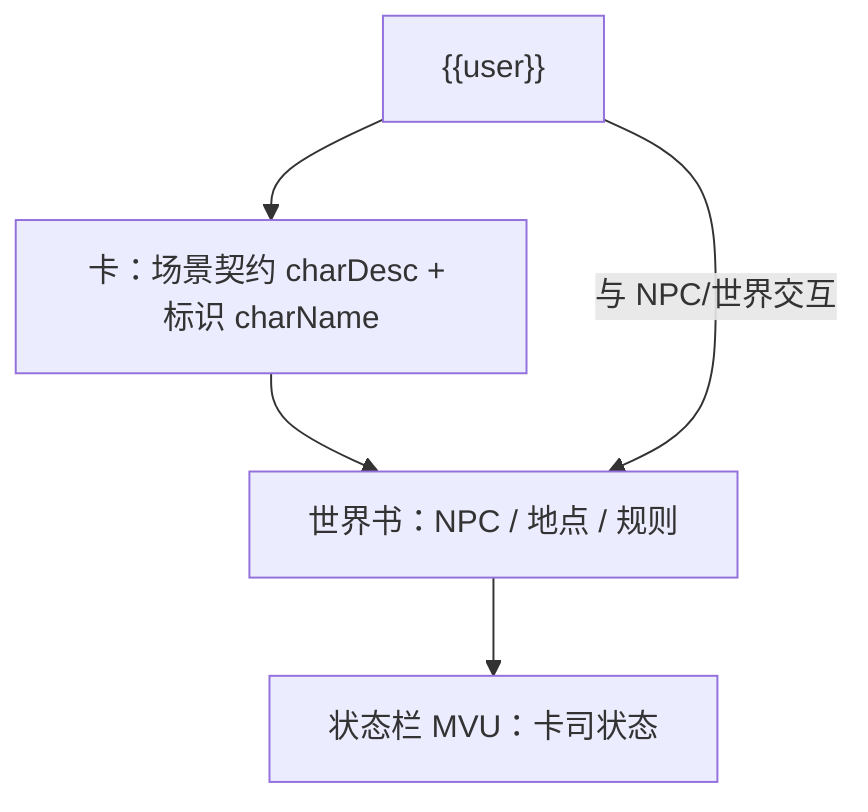
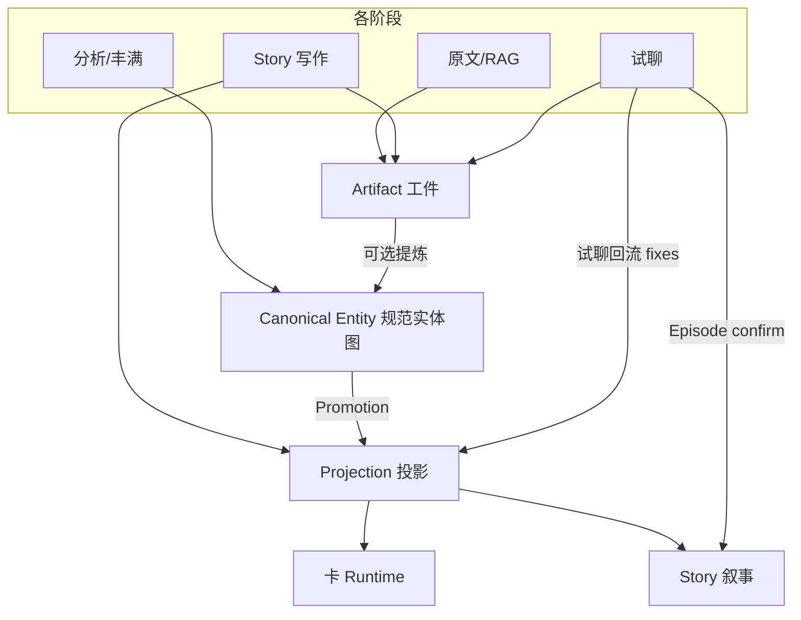

# 核心设计思想：AI 虚构体验平台

> **SoT**：本文定义产品级北极星、四模块关系、融合/发散边界与已决契约。  
> 模块实现细节仍分别见 [`overview.md`](./overview.md)、[`card-builder.md`](./card-builder.md)、[`novel-workshop.md`](./novel-workshop.md)、[`story-studio.md`](./story-studio.md)、[`chat-runtime.md`](./chat-runtime.md)。  
> **改行为前先读本文**；若实现与本文冲突，要么改代码对齐本文，要么在本 PR 修订本文并说明理由。

## 1. 北极星

本产品不是四个并列工具，而是一条 **「虚构体验闭环」**：

- **酒馆角色卡** ≈ AI 辅助的 **交互式角色扮演（RP）** — 即兴、回合、强人设、低延迟。
- **小说创作（Story Studio）** ≈ **叙事向游玩** — 写、读、分支、发布；与 RP **同族、不同机制**。
- **小说工坊** ≈ **从长文/原著解析出可扮演素材** — 读、拆、结构化、同步到卡。
- **试聊** ≈ **扮演向游玩的验收与真玩** — 在 ST 对齐的运行时里验卡；改卡经 **助手试聊回流（可选，用户择 fixes）**，见 §6.3.6。

**一句话**：卡是 **可扮演的运行态**（默认 **场景 + 卡司 + 世界**，见 §2.1）；工坊是 **文本 → 可扮演素材**；创作是 **叙事向生产与阅读**；试聊是 **RP 的实验室与游玩入口**。  
融合的不是 UI 堆砌，而是 **同一套「实体—关系—状态—文风—版本」对象**，在不同模式里换 **交互壳**。



## 2. 四种玩法：定位对照

| 模式 | 用户在做什么 | 时间尺度 | 核心产出 | 交互节奏 |
|------|-------------|----------|----------|----------|
| **制卡** | 设计「扮演契约」：谁、世界、怎么触发、状态怎么变 | 小时～天 | ST 卡（可导出、可试聊） | 步进编辑、模块门控 |
| **小说工坊** | 读原著/长文，拆人物、世界、关系、文风 | 小时～天 | 绑卡实体库 + RAG + 可同步到卡 | 流水线分析、批量同步 |
| **试聊** | 即兴扮演，测卡是否崩、空、OOC | 分钟～小时 | 体验结论 + 改卡线索 | 回合对话、低延迟 |
| **小说创作** | 写长篇、开分支、发布/分享、读者选线 | 天～月 | Story 小说 + release | 结构编辑、章节流、阅读态 |

**必须保留的发散**：RP 要低延迟强人设；创作要结构/版本/分支；工坊要忠实原文与 RAG。  
**必须打通的融合**：人物、关系、世界规则、文风、成人层 — **同一语义，多处读写**。

### 2.1 多人卡原生（ST 数据结构不变 · 2026-08）

社区实践里，绝大多数可玩卡是 **`{{user}}` 与众多 NPC、世界规则交互** 的群像/场景 RP，而非严格 1v1 单角色卡。  
**本项目从设计哲学上默认「多人卡原生」**：卡首先是 **可扮演场景 + 卡司 + 世界契约**；**不**把「一张卡 = 一个 AI 扮演对象」当作默认心智。

**ST V3 字段槽位不能改**，因此在 **不改导出 schema** 的前提下，重新定义各槽位的**产品语义**（与 ST 官方「单 description = 单人设」的教程语义并存，但本工具 **引导作者按下列分工写**）：

| 字段 | ST 原生常见用法 | **本项目默认语义（多人原生）** |
|------|----------------|-------------------------------|
| `name` / `charName` | 角色名 | **卡/场景对外标识名**（作品名、地点、群像名等）；**不是**「唯一扮演对象的名字」 |
| `description` / `charDesc` | 单一角色人设 | **场景帧 + RP 契约 + 全局交互规则**（局面、叙事视角、多 NPC 调度约定、禁止 OOC 等）；**不是**某一个 NPC 的完整传记 |
| `character_book` | 世界与触发 lore | **卡司与世界的真相源**：`[小说人物]` 人物条目、地点/规则/关系、成人层等 |
| `first_mes` | 开场白 | **多角色可共用的场景开场**（可出现多人、环境、局面） |
| `creator_notes` | 作者注 | 游玩/meta 指令（与 ST 一致） |
| MVU / 状态栏（扩展） | — | **运行时状态**：主角固定 `角色.字段`，女角色 `NPC.姓名.字段`，两套独立路径 |

**单人卡**：视为 **卡司 N=1 的退化形态**（`charDesc` 可兼容纳那一人的摘要，但世界书仍可用于规则/状态）；状态栏只勾主角时只写 `角色.*`，**不是**另一种产品品类。

**与工坊「protagonist / 主角」**：仅为 **分析锚点**（与 `charName` 标识对齐、进图谱），**不是**「卡扮演的主角」；人物档案 **默认进 worldbook**，不挤占 `charDesc`。

**与 Promote（§6.2）**：Story/工坊 → 卡 **只写 worldbook**；`charDesc` **不由 Promote 覆盖** — 与多人原生一致。

**卡无状态（游玩归档 · 2026-08）**：卡（含 ST 导出包内的 worldbook / MVU **设计**）表示 **可复用的场景契约 + 卡司 + 规则**，**不**承载某次试聊的剧情进展、变量终值或「本局记忆」。试聊 **Episode 归档只进 Story**（`plotLedger`、章节草稿），见 §6.3。**禁止**因试聊 Promote 而向卡写入 lore/快照/正史摘要。

**MVU 分工**：状态栏/MVU 在卡上是 **规则与结构**（怎么跟踪）；**某次游玩后的数值**不属于卡，若需留档 → Story `plotLedger`。

**实现差距（须逐步对齐哲学）**：

| 区域 | 现状 | 目标 |
|------|------|------|
| 制卡 UI / 写卡指南 | 部分文案仍像「单角色 description」 | 默认引导：人物 → worldbook，charDesc → 场景契约 |
| 工坊 sync 多人落卡 | 第一人写 `charName` | 长期：`charName` = 场景标识；**人物一律 worldbook**（迁移策略另 PR） |
| 试聊 `chatRuntime` | 仍单 `{{char}}`、`Continue as {charName}` | **群像 RP 试聊**（多角色调度、焦点），见 §5.3 |



## 3. 对象模型（融合中枢）

后续功能围绕 **四类对象 + 三层语义** 转，而不是四个 silo 各写各的，也 **不是每模块各存一套实体**。

### 3.1 四类对象

| 类型 | 是什么 | 典型例子 | 跨阶段 |
|------|--------|----------|--------|
| **Artifact 工件** | 某阶段的原始或半原始产出 | 拆章、分析 run、RAG 索引、试聊 transcript、Story 大纲树 | 通常 **阶段私有**，可版本化 |
| **Canonical Entity 规范实体** | 虚构世界里 **有稳定身份、可指代** 的事实 | person / lore / location + relations | **绑卡单源**（§3.8） |
| **Projection 投影** | 给某消费者用的 **物化视图** | worldbook 条目、Story 节点（可带 `entityRef`）、MVU path | 可重建、可 dirty |
| **Promotion 晋升** | 用户 confirm 的 **跨阶段写入事件** | sync 到卡、seed Story 图谱、试聊正史回写 | 可审计（实现待定） |



**设计结论（2026-08 讨论）**：

- 「阶段性编辑 → **缓存结论** → 决定谁进下一阶段」**方向正确**；工坊 `entities[]` + `selected` + `syncStatus` 已是雏形。
- **错误方向**：Story `graph.nodes`、卡 `worldbookEntries`、工坊 `entities`、试聊抽取各当 **平级第二套实体库** → 同名漂移、merge 成本、语义混叠。
- **正确方向**：**一套 Canonical Entity + 各模块 Projection + 显式 Promotion**；缓存不全是 entity（见 §3.6）。

### 3.2 三层语义（消费视角）

与 §3.1 正交，描述 **进 prompt / 进导出** 时分层：

#### 实体语义

- **人物**（person）、**地点/势力/规则**（lore）、**关系边**（relation）。
- **规范实体 SoT**：工坊 `entities[]` + `relations[]`（[`novel-analysis.md`](./novel-analysis.md)）；图谱为 **视图投影**，不是第三套数据。
- **来源**：工坊分析、手写卡（升格）、Story 写作后提取（进 Review）、试聊 **Episode → Story**（§6.3，非 Entity SoT）。
- **归宿**：投影到 worldbook / Story 节点 / MVU 设计 / RAG 检索键。

#### 叙事语义

- **章节/片段**（工坊 chapters）、**Story 章 + 分支**、**试聊 Episode（Artifact）**。
- **操作**：摘要、feed-forward、RAG、发布裁剪、读者进度。

#### 运行语义

- **卡 JSON** + **正则 / MVU / 脚本** + **试聊 messages**。
- **目标**：下一轮上下文里 **谁说什么、世界怎样、状态多少**（与 ST 导出一致）。
- 卡的 worldbook **是 Runtime 投影**，不是第二套实体库；投影链字段见 **§3.8**。

### 3.3 三闸门（跨阶段统一）

不必每模块发明一套规则，统一三类：

| 闸门 | 含义 | 现有近似 |
|------|------|----------|
| **Include** | 是否进入下一阶段 **候选集** | `entity.selected`、章节勾选 |
| **Review** | 系统建议人工先看 | `needsReview`、`confidence` |
| **Promote** | 是否 **写入下游 Projection**（须 confirm） | `sync_novel_entities`、`graphSeed`、export |

**默认策略**：

| 流向 | 规则 |
|------|------|
| Analyze → Entity | 增量 upsert；**禁止**空数组覆盖已有 entities（除非用户确认清空） |
| Entity → Card | 仅 `selected` 且（`unsynced` / `dirty`）可 Promote |
| Entity → Story | seed 时带 `entityRef`；同名合并为 Ref 节点 |
| Chat → Entity / Artifact | **默认不自动 Promote**；用户标记「正史」才晋升 |
| Story 写作 → Entity | 可选「从本章提取」→ 进 **Review** 队列，不直写卡 |

### 3.4 Story 图谱节点（双类）

Story 的 node **不必**复制完整 entity schema：

| 节点 | 何时用 | 约定 |
|------|--------|------|
| **Ref 节点** | 来自工坊/卡 | `entityRef: 'ent_xxx'`；展示从规范实体拉取 |
| **Narrative 节点** | 原创情节占位 | 仅 `name` / `note` / `plotRole`；写作后可 **升格** 为 entity |

Story 保持 **叙事脚手架** 定位，与工坊实体库不抢 SoT。

### 3.5 阶段缓存与晋升（体验路径映射）

§6.1 四阶段与对象操作对应：

| 体验阶段 | 主要读写 | 闸门 |
|----------|----------|------|
| **备料** | Artifact + Canonical Entity（工坊分析） | Include / Review |
| **成卡** | Entity → Projection（sync 到卡） | Promote |
| **试玩** | Runtime + Chat Artifact | **试聊回流** fixes → 卡 Projection（§6.3.6）；**Episode** → Story（§6.3）；**不** Promote 本局剧情/MVU 终值进 Entity |
| **发布** | Projection 冻结 + Story release | 版本快照；不反向改 Entity |

`cardJourney` / 路径图可读指标示例：`entityCounts`、`selectedCount`、`unsyncedCount`、worldbook 是否空、是否试聊、Story 是否 touched。

### 3.6 非 Entity 清单（禁止万物 entity）

| 对象 | 归类 | 原因 |
|------|------|------|
| 文风 profile | Artifact 或卡上单条 worldbook | 全局风格，非命名个体 |
| Story 大纲 / 章节树 | Narrative Artifact | 结构，非世界观条目 |
| Story 卷/弧摘要、大纲检索索引 | Narrative **Memory**（派生 Artifact） | 服务有界 AI 上下文；可自 Spine+Body 重建 |
| MVU path / 状态栏 layout | Runtime 配置 | 服务扮演 |
| 试聊整段对话 | Artifact（Episode） | 晋升时只抽摘要/状态 |
| RAG chunk | 索引 Artifact | 检索用，非知识条目 |

**Entity 边界**：有稳定身份、可指代、可写进 worldbook/图谱的「世界中的东西」。

### 3.6.1 Story Narrative Artifact 规模分层（千章 · 2026-08）

Story 大纲/章节树在 §3.6 已归类为 **Narrative Artifact**。千章级须 **逻辑一体、访问分层**（非拆成多部作品）：

| 层 | 职责 | 与 Entity 关系 |
|----|------|----------------|
| **Spine** | 分支、outlineIndex、章 stub、release 元数据 | 不含 entity 正文 |
| **Body** | 章 `content` / feedForward / quality 等 | 可含 `sourceMeta`；**不**复制工坊 entity |
| **Memory** | 卷/弧摘要、大纲检索索引 | **派生**，类比工坊 RAG 索引 |
| **Scaffold** | `graph`、`plotLedger` | 叙事脚手架；Ref 节点链 `entityRef` |

**设计顺序**：先定 **L1 访问契约**（加载/保存/有界 prompt/流式导出），再映射 IDB 分片与 UI 虚拟列表。  
**禁止**：为规模默认把一部书拆成多个 catalog novel；禁止任一消费者假设全书 `content[]` 常驻内存。  
**SoT**：[`story-scale.md`](./story-scale.md)。

### 3.7 投影规则（Promote 出口）

| 流向 | 规则 |
|------|------|
| 工坊解析 → 卡 | Canonical Entity → Projection（现有 `sync_novel_entities`） |
| Story 写作 → 卡 | Entity / Narrative → **可选** Promote 为开场白、worldbook、MVU 草案 |
| 制卡 → Runtime | 手写 Projection + 最小 Entity（可选升格） |
| 试聊 → Story | Episode **只** Promote 到 Story（§6.3）；**不进卡** worldbook / MVU 值 |
| 试聊 → 卡（QA） | 仅 **试聊回流 fixes**（结构/契约修正，confirm）；**禁止**写入本局剧情/变量终值 |

**禁止**：Story 工作稿、工坊 IDB/RAG **默认塞进** ST 导出 JSON。桥是 **Projection / Promote**，不是单文件大一统。

### 3.8 投影链接：`sourceRef`、dirty 与是否切断

#### 已决：Canonical Entity 绑卡（2026-08）

| 决策 | 结论 |
|------|------|
| 规范实体 SoT 存哪儿 | **绑卡**：`novelWorkshopV3:card:{cardId}` + `novelRagV1:card:{cardId}` |
| 云 bundle | 工坊 + RAG **随卡**；Story catalog 仍 `cardId` 索引、存储独立 |
| 跨卡复用设定 | **复制 / 导入 entity 快照**，非默认 live 共享；未来若做「引用他卡工坊」须 **显式只读 link**，不升格独立 `worldId` SoT |

#### 已决：手改投影 — **默认不切断链接**（2026-08）

用户在 **卡 worldbook**（或 Story **Ref 节点**）上手工编辑时：

| 行为 | 规则 |
|------|------|
| **默认** | **保留** upstream 链接；投影标记 **`linkStatus: linked` + `dirty`** |
| **工坊 entity** | 对应 entity **`syncStatus → dirty`**（投影侧手改须反向可见，便于工坊列表/路径图提示） |
| **再次 Promote / resync** | 走现有 **`overwrite \| merge \| skip`**（[`sync.mjs`](../../src/lib/novel/sync.mjs)）；**不**因 dirty 自动 detach |
| **显式「解除与工坊链接」** | 用户操作 → **`linkStatus: detached`**，清 `sourceRef`；条目变为 **`owner: user` 或 detached novel 条目**，此后 resync **不再触碰** |
| **自动 detach（仅破坏性编辑）** | 改 **身份键** 时切断：`displayName` / `ownerSlot` / `kind` 变更、或工坊侧 **删除** 该 entity |

**为何默认不切断**：手改多数是 **为 RP 微调**（触发词、order、删冗余），不是「从此与原著无关」；保留链接才能 **选择性 resync**（未改条目 overwrite、已改条目 merge/skip）。

**为何仍要 detach 路径**：用户把条目改成另一人物、或坚决不让工坊覆盖时，需要 **可预期的停止同步**；静默 overwrite 比 detach 更危险。

#### 投影链字段（目标契约；实现逐步补齐）

卡 worldbook V2 条目（及 Story Ref 节点）在 Promote 时写入：

```js
{
  sourceRef: { type: 'entity', id: 'ent_xxx' },  // 或 storyNode_xxx | manual
  linkStatus: 'linked',   // linked | detached
  projectionDirty: false, // 投影相对 entity 上次 Promote 是否有手改
  promotedAt: 'ISO8601',  // 可选：末次 Promote 时间
}
```

工坊 entity 侧沿用 **`syncStatus`**（`unsynced | synced | dirty`）。  
**匹配键（现状）**：`owner: novel` + `kind` + `ownerSlot`（由 entity 名/类型派生）；`sourceRef.id` 为显式加固，二者应一致。

#### resync 决策表（linked + dirty）

| 投影状态 | 默认 resync（merge 策略） | 说明 |
|----------|---------------------------|------|
| linked, 未 dirty | overwrite 内容字段 | 与现 sync 一致 |
| linked, dirty | **merge** 或弹窗三选一 | 保留手改块 + 合并 entity 新摘要/keys |
| detached | skip | 不参与批量 sync |
| entity 已删 | 投影保留，标 **orphan**；用户选删或转 manual | 不 silent 删卡上条目 |

Story Ref 节点：`entityRef` + 同上 `linkStatus`；手改 `note` → dirty，不自动变 Narrative 节点。

#### 已决：Promotion audit — **L0 只读史，不做回滚**（2026-08）

| 决策 | 结论 |
|------|------|
| 是否持久化 | **是**：绑卡 IDB **append-only** Promote 摘要 log（建议 cap 100～200 条/卡） |
| 记录范围 | 仅 **跨层 Promote**（sync、seed、正史回写、detach、跨卡导入快照）；层内 autosave **不记** |
| 回滚 / snapshot | **不做**；正式回退走 **卡 versions / Story versions**；投影冲突走 **dirty + resync policy + detach** |
| 上云 | **默认不上云**（或仅同步聚合字段如 `lastNovelSyncAt` 供路径图） |
| log 用途 | 解释 dirty/orphan、路径图/journey、助手 `list_promotions`（近 N 条） |

单条 log 最小字段：`id`、`at`、`cardId`、`kind`、`source`、`target`、`policy?`、`actor`、`summary`。**无** `snapshotRef`。

#### §3.8.1 投影链 + Promotion L0 实现契约（D16 · 已决 2026-08）

##### Promotion L0（共享基础设施）

| 项 | 契约 |
|----|------|
| **键** | `promotionLogV1:card:{draftId}`（IDB append-only，cap **200**） |
| **上云** | **否**（与试聊 session / Episode 同级） |
| **写入时机** | 任意跨层 Promote（工坊 sync、Story↔卡、试聊归档、detach、跨卡导入快照） |
| **助手** | `list_promotions({ limit? })` 只读近 N 条；**不**提供回滚 |

建议模块：`src/lib/promotionLog.mjs`（append / list / cap trim）；删卡级联清理。

##### 投影字段写入（Promote / sync 时）

worldbook V2 条目与 Story `entityRef` 节点在 **首次 Promote** 时写入 §3.8 字段；手改 worldbook 正文 → `projectionDirty: true` + 反向 `entity.syncStatus: dirty`。

##### 手改 / detach 触发（executor 或 worldbook 面板）

| 事件 | 行为 |
|------|------|
| 改 content / keys / order（非身份键） | `projectionDirty: true`；**保留** `linkStatus: linked` |
| 改 `displayName` / `ownerSlot` / `kind` | **自动 detach**：`linkStatus: detached`，清 `sourceRef` |
| 用户点「解除与工坊链接」 | 同上 detach |
| entity 在工坊已删 | 投影标 **orphan**；UI 提示删或转 manual |

##### resync（复用 `sync.mjs` policy）

linked + 未 dirty → overwrite；linked + dirty → merge 或弹窗三选一；detached → skip。

##### D16 实现触点

| 层 | 文件 |
|----|------|
| L0 | `promotionLog.mjs` |
| 投影 | `novel/sync.mjs`、`worldbook` 写路径、`storyStudio/graphUi.mjs`（Ref dirty） |
| 助手 | `assistant/tools.mjs`：`list_promotions` |
| 测试 | `tests/promotionLog.test.mjs`、`tests/sourceRef.test.mjs` |

## 4. 各模块设计原则

### 4.1 制卡 — 「扮演契约编辑器」

- **主问题**：开聊前，模型必须知道什么？→ **局面、卡司、世界规则、状态如何维护**（§2.1）。
- **默认形态**：**多人卡原生** — 人物在 worldbook，场景/规则在 `charDesc`，状态在 MVU；单人 = 卡司为 1。
- **强化**：绑卡向导、世界书分工、状态栏两套独立路径、试聊验 **群像可玩性**、导出检查。
- **避免**：把多个 NPC 传记塞进 `charDesc`；应 **工坊/Story → Entity → worldbook Promote**，`charDesc` 保持场景层。

### 4.2 小说工坊 — 「原文 → 可扮演素材」

- **主问题**：这篇小说里，谁能扮演、世界规则是什么？
- **强化**：分析图谱 = 实体 **视图**；同步到主卡 = **Promote → Projection**；RAG = 试聊/助手检索原文。
- **避免**：与 Story 抢「写作」定位。工坊 **只读拆解 + 同步**，不写长篇、不替代 Story 发布。

### 4.3 试聊 — 「扮演实验室」

- **主问题**：这张卡玩起来像不像、稳不稳？→ 对 **多人原生** 卡，还须问：**卡司是否各就其位、世界是否按规则响应**。
- **强化**：场景化试聊、ST 世界书/正则/MVU 管线、回流改卡；**长期** 群像调度（§5.3）。
- **避免**：试聊变成第二创作台；长产出 **只归档 Story**（§6.3），不在 chat 堆正文、**不写 worldbook 正史**。

### 4.4 小说创作 — 「叙事向游玩 + 出版」

- **主问题**：故事怎么长起来、怎么分支、怎么给人读？
- **强化**：图谱 / 大纲 / 写作 / 阅读 / 管理；分支与 release；分享读者选线。
- **避免**：要求每部 Story 都必须绑一张 RP 卡（**存储独立是对的**），但 **Story ↔ 卡 的桥须显式**。

## 5. 群像试聊 runtime

§5.1 / §5.2 的 2026-08 现状快照已移入 [`../archive/philosophy-tracker-2026-08.md`](../archive/philosophy-tracker-2026-08.md)，不是现行依据。§5.3 仍是试聊契约。

### 5.3 群像试聊 runtime 设计契约（D2 · 已决 2026-08）

**目标**：试聊 prompt 与 §2.1 **多人卡原生**一致 — `charDesc` = 场景契约，NPC = worldbook；**不**把 `charName` 当作唯一 AI 扮演对象。

#### 5.3.1 试聊内语义

| 概念 | 定义 |
|------|------|
| **场景标识** | UI 仍显示卡 `charName`；副文案提示「场景标识，非单人扮演」 |
| **叙述者/调度** | 模型按 charDesc **自行调度多 NPC**；单条 assistant 回复可含多角色对白（`Name:` 前缀） |
| **焦点 NPC**（可选） | 试聊配置抽屉：**无焦点**（默认）/ 从 worldbook `[小说人物]` 选一人 — 仅影响 **Continue** / **regenerate** 软提示，**非**硬锁单角色 |
| **`{{char}}` 宏** | **Phase 1**：仍映射 **场景标识**（与 ST 导出一致）；system 层补充「勿将 {{char}} 当作唯一角色」 |
| **Continue 指令** | 不用 `Continue the chat as {charName}`；改为场景契约续写 + 可选焦点（见 5.3.3） |

#### 5.3.2 Prompt 组装（相对现状）

1. **不变**：世界书 / 正则 / MVU / @D 管线（[`chat-runtime.md`](./chat-runtime.md)）。
2. **增**：system 或作者注层注入 **§2.1 场景契约短提醒**（不重复灌整段 charDesc）。
3. **改**：`build.mjs` 说话人前缀检测 — 除 `charName:` 外，纳入 **worldbook person 名**（激活条目 + 常量 `[小说人物]` 名）。
4. **Phase 2（不在 D2 首 PR）**：焦点 NPC selective 提权、自动轮换焦点。

#### 5.3.3 Continue / regenerate 文案（Phase 1 契约）

默认（无焦点）：

```text
Continue the scene following the RP contract in the character description.
Speak for any relevant NPCs from the worldbook; do not collapse the scene into a single-character monologue unless the contract requires it.
```

有焦点 `{focusName}` 时追加：

```text
Give extra narrative weight to {focusName} in this turn, without excluding other NPCs when they should react.
```

#### 5.3.4 与 statusBar / MVU / 归档

- 试聊 MVU 仍驱动 **卡司 cast**；群像卡各 NPC 变量平等更新。
- Promote MVU 快照 = **Promote 时刻 runtime 全 cast**，不单取 `mainName`（§6.3.7）。
- 试聊回流 OOC：issue 须区分 **场景契约**（charDesc fix）vs **某 NPC**（worldbook person fix）— 与 §6.3.7 禁止表一致。

#### 5.3.5 验收（D2 PR）

| 检查 | 期望 |
|------|------|
| 群像示例卡 | assistant 回复可出现 ≥2 个具名 NPC |
| Continue | 不会整段退化为单一 `charName` 独白 |
| `{{char}}` | transcript / 宏替换仍指场景标识，不崩 |
| 单人退化卡 | 行为与现网 **不回归** |

**预期改动**：`chatRuntime/prompt/build.mjs`（Continue + 契约注入）、`playgroundBoot.mjs`（焦点 UI + person keys）、`tests/chatRuntime.test.mjs`。

## 6. 已决契约

以下按 **闭环完整度** 排序；每一项本身须是可长期维持的完整步，而非临时补丁。

### 6.1 卡进度状态机（助手优先 · 已决 2026-08）

**定位**：制卡闭环的 **流程 SoT** — 指导助手「缺什么 / 下一步」、轻量 UI（卡管理角标、`cardJourney` tip）与 future 门控；**不是**第二套侧栏大导航。

**用户实际入口**（不变）：侧栏功能 + **右栏助手**（新手问做法，老手直接下命令再手改）。状态机 **重点强化** 在 **可被助手读取**，UI 仅只读、视觉与阶段名一致。

#### 6.1.1 四阶段（逻辑顺序，非硬门禁）

| 阶段 | 含义（§2.1 多人原生） | 典型动作 |
|------|------------------------|----------|
| **prepare** 备料 | 卡司/世界素材进 worldbook 或工坊 entity | 工坊分析、Promote、手写条目 |
| **shape** 成卡 | 场景契约 + 运行层就绪 | charDesc、状态栏/MVU、正则 |
| **playtest** 试玩 | 验证可玩 | 试聊（Story 阅读自测可选） |
| **publish** 发布 | 对外 | 导出检查、上云、Story 发布 |

`phase` 可由 signals **软推导**（见下），用于助手话术；**禁止**用「卡司 ≥N 人」之类硬阈值挡功能。

#### 6.1.2 Signal 分类（要不要精确阈值）

| 类型 | 含义 | 示例 | 阈值策略 |
|------|------|------|----------|
| **touched** | 用户是否碰过模块 | `novelTouched`、`storyTouched` | **无** — 布尔即可 |
| **event** | 是否发生过关键事件 | `playtested`、`exportChecked`、`lastPromoteAt` | **无** — 有记录即 true |
| **filled** | 字段是否有实质内容 | `hasSceneContract`、`hasCharIdentifier` | **最低栏** — 非空 + 反占位（如 charDesc trim ≥ 40 字且非默认模板）；**不**评质量 |
| **metric** | 计数仅供展示/助手描述 | `worldbookPersonCount`、`entitySelectedCount` | **不设达标线** — 1 人与 20 人皆可发布；助手说「当前 3 名人物条目」，不说「还差 7 人」 |
| **dirty** | 与云/投影是否一致 | `novelUnsyncedCount`、`cloudDirty` | **无** — 计数或布尔 |

**原则**：**卡司人数、世界书条数、工坊 entity 数** 一律 **metric**，**永不**作为「能否进入下一阶段」的硬条件。用户要 1 个 NPC 或 20 个都合法。引擎不得按世界观、人物、地点、物品等类型配额生成世界书。

#### 6.1.3 状态对象（目标契约 · 实现 `cardProgress.mjs` 或扩 `cardJourney`）

```js
{
  cardId: string,
  phase: 'prepare' | 'shape' | 'playtest' | 'publish',  // 软推导，可与其他 phase 并存建议
  signals: {
    // touched / event
    novelTouched: boolean,
    storyTouched: boolean,
    playtested: boolean,
    exportChecked: boolean,
    lastPromoteAt: string | null,
    lastPromoteKind: string | null,
    // filled（最低栏）
    hasCharIdentifier: boolean,   // charName 非空且非「无名角色」
    hasSceneContract: boolean,    // charDesc 通过 filled 启发式
    hasStatusBarOrMvu: boolean,   // 注入过状态栏或 mvu 设计非空
    // metric（仅展示）
    worldbookPersonCount: number,
    worldbookEntryCount: number,
    entityCount: number,
    entitySelectedCount: number,
    novelUnsyncedCount: number,
  },
  blockers: string[],       // 助手用：仅 **filled/event** 类，不含「人数不足」
  suggestions: Array<{      // 助手优先消费
    id: string,
    label: string,
    hash?: string,
    tool?: string,
    priority: number,
  }>,
  updatedAt: string,
}
```

**phase 软推导（示例，非阻断）**：

- 无 `hasSceneContract` 且 `worldbookPersonCount === 0` → 倾向 **prepare**
- 有 `hasSceneContract` 或 `worldbookPersonCount > 0`，未 `playtested` → **shape** 或 **playtest**
- `playtested` 且未 `exportChecked` → 倾向 **playtest** → **publish** 建议

#### 6.1.4 消费者

| 消费者 | 行为 |
|--------|------|
| **助手** | `assistantBuildGuide` / 快捷「本卡进度」「下一步」**只读**本对象；metric 用叙述（「已有 2 条人物世界书」），不用达标/未达标 |
| **cardJourney tip** | `suggestions[0..2]` + hash；可 dismiss |
| **卡管理 meta** | 1 行角标：`playtested` / `novelUnsynced` / `cloudDirty`；**不**做大路径条 |
| **Promotion L0** | 写入后刷新 `lastPromoteAt` / counts |

#### 6.1.5 明确不做

- 侧栏「进度」Tab、满屏向导、按人数/条数 **disabled** 功能（Action Engine 仍只管重任务互斥）
- 「卡司 ≥ N 才算成卡」类产品规则

实现见卡进度与助手 location（`assistant.md`），不另立票号。

### 6.2 Story ↔ 卡 双向桥（与工坊对称）

三条 Promote 方向（均走 §3.8 链接 + §3.8 Promotion L0 log）：

| 方向 | 现状 | 目标 |
|------|------|------|
| **卡 → Story** | 图谱页「从卡面种子」(`seedGraphFromCard`) | 新建 Story 向导可选 **预填图谱**；节点带 `sourceRef: { type:'card', … }` |
| **工坊 → Story** | 无 | 「用设定开 Story」：entity/relations → Ref 节点 + edges；**不**导入 chapters 正文 |
| **Story → 卡** | **无** | 图谱 + 助手 Promote → worldbook（不写 charDesc）；§6.2.1 |

#### 6.2.1 Story ↔ 卡（议题 4 · 已决 2026-08）

**交付原则**：三条 Promote 方向 **一并做全**（UI + 助手工具 + 数据链 + Promotion L0 log + §3.8 `sourceRef`），禁止只上图谱按钮、无逆向 Promote / 无工坊→Story / 无助手面的「半桥」。

**卡字段语义（§2.1 多人原生）**

- **`charName`**：卡/场景标识（ST 兼容名），**不是**「唯一扮演对象」。
- **`charDesc`**：场景帧 + RP 契约；**NPC 传记在 worldbook**。
- **Story/工坊 Promote**：只写 worldbook；**不**覆盖 `charDesc` / `charName`（除非用户于「角色设定」手改）。
- 工坊 **protagonist** = 分析锚点，不是卡主角。

**Story → 卡**

1. **入口（均需）**：图谱多选 → **「同步到角色卡」**；助手 **`promote_story_graph_to_card`**（`confirm`，参数对齐 `sync_novel_entities`：`ids?`、`policy?`）。
2. 弹窗：预览 + **overwrite | merge | skip** + 目标勾选（世界书人物 / 设定地点 / 关系摘要条）。
3. 映射：character → `novel_person`；location/other → `novel_setting`；边 → **独立 lore 条或 relation 槽**（与工坊 sync 槽位规则一致，**不单删为「首版合并进 note」**）；Ref 节点优先 entity 正文。
4. 写卡 draft + `sourceRef: { type:'storyNode', id, novelId }` + Promotion log `story_to_card`。

**卡 → Story**

1. 新书向导：**「从当前卡导入设定」**（默认勾可选）。
2. 增强 `seedGraphFromCard`：节点 `sourceRef: { type:'card', entryId? | charSlot }`；图谱/助手 **`seed_story_graph_from_card`**。

**工坊 → Story**

1. 工坊图谱或人物列表 → **「用设定开新 Story」** → 创建 novel + Ref 节点（`entityRef`）+ relations→edges；**不**导入 chapters 正文 / RAG。
2. 助手 **`seed_story_from_novel_entities`**（confirm）。

**同名与冲突**

- Story 节点 vs 工坊 entity vs 已有 worldbook：**同 `ownerSlot` merge**（复用 `findNovelSlotIndex` + conflict policy）。
- **不**自动双向同步工坊 entity 与 Story 节点；用户显式 Promote 或 detach。

**不在本桥范围内（避免 scope 膨胀）**

- Story **章节正文** bulk 进 worldbook / firstMes（属 §6.3 试聊/叙事回写或独立「正史 Promote」）。
- **MVU / 状态栏自动生成**（属状态栏面板 + 可选未来 Promote；不与图谱 sync 混同一弹窗）。

**实现 SoT 触点（PR 时更新）**：见 **§6.2.2**（D17）。

#### 6.2.2 Story↔卡桥实现契约（D17 · 已决 2026-08）

**交付原则**（同 §6.2.1）：三向 **一并做全**；每条 Promote 写 **D16** L0 + **`sourceRef`**（§3.8）。

##### Story → 卡

| 项 | 契约 |
|----|------|
| **UI** | Story 图谱多选 → **「同步到角色卡」**（`.btn-inline` 收纳于图谱操作区） |
| **助手** | `promote_story_graph_to_card({ ids?, policy? })` — confirm；参数对齐 `sync_novel_entities` |
| **弹窗** | 预览 + overwrite \| merge \| skip + 目标勾选（人物 / 地点 / 关系 lore） |
| **写卡** | worldbook only；`sourceRef: { type:'storyNode', id, novelId }` |
| **L0** | `kind: story_to_card` |

##### 卡 → Story

| 项 | 契约 |
|----|------|
| **UI** | 新书向导 **「从当前卡导入设定」**（默认勾可选） |
| **助手** | `seed_story_graph_from_card({ novelId? })` — 增强现有 `seedGraphFromCard` |
| **写 Story** | Ref / Narrative 节点 + `sourceRef: { type:'card', entryId? \| charSlot }` |
| **L0** | `kind: card_to_story` |

##### 工坊 → Story

| 项 | 契约 |
|----|------|
| **UI** | 工坊图谱 / 人物列表 → **「用设定开新 Story」** |
| **助手** | `seed_story_from_novel_entities({ entityIds?, novelTitle? })` — confirm |
| **写 Story** | 新建 novel + `entityRef` 节点 + edges；**不**导入 chapters / RAG |
| **L0** | `kind: workshop_to_story` |

##### 冲突与 merge

- 同名 / 同槽：复用 `findNovelSlotIndex` + 现有 conflict policy（overwrite \| merge \| skip）。
- **不**自动双向同步；仅用户显式 Promote 或 detach（§3.8）。

##### D17 实现触点

| 层 | 文件 |
|----|------|
| Story 图谱 | `storyStudio/graphUi.mjs`、`graphSeed.mjs` |
| 工坊 | `novel/graphUi.mjs`、工坊人物列表 actions |
| 同步核心 | `novel/sync.mjs`（Story 节点 → worldbook 映射） |
| Story 创建 | `storyStudio/manageActions.mjs`（向导 + seed） |
| 助手 | `assistant/tools.mjs` + `executorExecute.mjs`（三工具） |
| 投影 | 依赖 **D16** `sourceRef` / dirty |
| 测试 | `tests/storyCardBridge.test.mjs` |

### 6.3 试聊 ↔ Story 归档（议题 7 · 已决 2026-08）

> **卡无状态**（§2.1）：试聊产出 **不掺和进卡**（不写 worldbook、不写 MVU 变量终值、不写 charDesc）。  
> 与 **试聊回流 QA**（`analyze_chat_feedback` / fixes）**分离**：fixes = 设定/结构质检；**归档** = 玩法进 **Story**。

> **键名约定**：下文 **`draftId`** = 当前卡 draft id（与制卡 state、`st_v3_*` session 键一致）。Story IDB catalog / novel 键中的 **`cardId`** 与 **`draftId` 同指**，勿混成两个实体。

#### 6.3.1 试聊 Episode（Artifact）

- **Transcript SoT**：`st_v3_chat_playground_session:{draftId}`（`localStorage`，§6.3.6）；每条消息 stable **`id`**。  
- **Episode**（IDB `chatEpisodeV1:card:{draftId}`）：**不重复存正文**；只存 `messageIds[]`、`transcriptDigest`、`createdAt`、`labels?` 等元数据，**引用** session 内消息。  
- 创建 Episode = **选段**（§6.3.6 弹窗）→ 写入 Episode 记录；可多次 Promote，**目标仅 Story**。

#### 6.3.2 Promote 出口（confirm；全部指向 Story）

| 出口 | 写入 | 说明 |
|------|------|------|
| **Story 章节草稿** | 所选 novel **草稿** 末尾 + 章占位 + 正文草案 | **不** publish；见 6.3.3 选书 |
| **plotLedger** | 伏笔/状态账本条目：摘要 + 可选 MVU JSON 附件 | **MVU 快照唯一落点**；不改 MVU 设计器 schema |
| ~~worldbook~~ | — | **禁止**（卡无状态） |
| ~~工坊 entity~~ | — | 二期；若做则仍 **Review**，且不写卡 |

**不做**：整段 transcript 进卡；Episode Promote 写 worldbook；自动 publish Story。

#### 6.3.3 选 novel（章节草稿 · B 变体）

1. **不要求** 用户先切到 Story 再试聊。  
2. Promote 弹窗勾「章节草稿」→ 展开 **novel 选择**：  
   - 若 Story Studio **已加载** 某部 novel（同 `draftId`）→ **默认选中**。  
   - 否则 → 下拉 **该卡 Story catalog**；可选「新建空白 novel 并写入」。  
3. 未选 novel → 仅允许写 **plotLedger**（若勾），或取消 Story 出口。

#### 6.3.4 MVU 快照 → 仅 plotLedger

- 来源：试聊结束时的 MVU/变量运行时值（`tavern_helper.variables` 等，以实现为准）。  
- 产物：`plotLedger` 一条（`title` / `status` / `note` + 可选 JSON 块）；**不**写 worldbook、**不**回写卡侧 MVU path。  
- 可与「章节草稿」同次 Promote，共用同一 novel 选择器。

#### 6.3.5 UX（归档 · Story）

1. 试聊 UI：**选段弹窗**（§6.3.6）→ 标记 **Episode**（D12）。  
2. 助手：**「归档到 Story」** → `promote_chat_episode`（confirm：novel、章草稿、plotLedger/MVU 快照）。  
3. Promotion L0：`kind: story_from_chat`；刷新 `signals.playtested`（发生过试聊即可，非必须归档）。

#### 6.3.6 试聊回流（改卡 · 与归档分离 · 已决 2026-08）

**定位**：试聊 = **游玩**；试聊回流 = **助手可选能力**（读持久化 transcript → 诊断 → **用户抉择**后改卡）。**不是**玩完自动改卡；用户也可 **不用回流、直接口述** 让助手改。

| 与归档 | 试聊回流（QA） | 归档 Story（§6.3.2） |
|--------|----------------|----------------------|
| 改卡？ | 是（契约/结构） | **否** |
| 写 Story？ | 否 | plotLedger / 章草稿 |
| 禁止 | 本局剧情/MVU 终值进 worldbook | 写回卡 |

**流程（已决）**

1. **选段（弹窗）**：试聊 Tab **不**在气泡上直接勾选。入口（试聊回流 / 标记 Episode 等）打开 **居中弹窗**：列表 **一行一条消息**，每行 **单行截断预览**（role + 摘要）；支持多选 / 全选 / 范围快捷；确认后得到 `messageIds[]`。未先选段而直接「分析最近」时，默认 **最近 N 条** 并在助手回复中 **明示范围**。  
2. **诊断**：`get_chat_feedback({ messageIds? })` 读 session + `analyze_chat_feedback`（只读）。  
3. **抉择（A）**：助手对话内列出编号 fixes；用户指定「只做 1 和 3」—— **禁止** silent 全量 apply。  
4. **应用**：仅选中 fixes → `apply_chat_feedback_fixes`；confirm **逐条** preview。  
5. **fixes 边界**：NPC → worldbook；charDesc → 场景契约；禁止 transcript/MVU 终值写卡。

**选段弹窗（已决 · 2026-08）**

- **不在 Tab 内** checkbox；试聊主界面保持纯 RP。  
- 弹窗：每行 = 一条消息；**只显示一行文本**（过长 `…`）；可选 role 图标/标签。  
- 共用组件：**试聊回流**、**标记 Episode**（D12）、将来扩展同一 `messageIds` 契约。  
- 选段结果 **会话内保留**（如 `ui.chatSelection.messageIds`），切到助手 Tab **仍有效**，直到用户清空或重新选段。

**试聊记录持久化（已决）**

- 键：`st_v3_chat_playground_session:{draftId}`（`localStorage`）。  
- 字段：`messages[]`（**id** / role / content / 可选 timestamp）、`updatedAt`；trim 上限与助手同级（如 80 条）。  
- **刷新/重进不丢**；切卡重载；删卡级联清理。  
- **不上云** bundle。

实现见 [`chat-runtime.md`](./chat-runtime.md)：session 与归档共用选段。

#### 6.3.7 试聊 session / 选段 / fixes 实现契约（D15 · 已决 2026-08）

##### 数据形状

```js
// localStorage: st_v3_chat_playground_session:{draftId}
{
  messages: [
    { id: string, role: 'user'|'assistant', content: string, at?: number }
  ],
  selection: {
    messageIds: string[],   // 弹窗确认后；跨 Tab 保留
    updatedAt: number
  },
  updatedAt: number
}
```

- **`id`**：创建时生成（建议 `msg_` + 短 uuid）；**trim 80 条时 id 随消息删**，Episode 引用丢失 id 须 **跳过并提示**（不 silent 失败）。  
- **`selection`**：弹窗点「确定」写入；点「取消」不改；**重新选段**覆盖。

##### 默认 analyze 范围

| 场景 | 行为 |
|------|------|
| 已有 `selection.messageIds.length > 0` | analyze **仅**这些 id（顺序按 session 时间） |
| 无选段，用户/chip「试聊回流」 | 默认 **最近 16 条**（与现 `analyze_chat_feedback` 一致）；助手 **首句明示**「分析了最近 16 条（共 N 条记录）」 |
| 弹窗内「分析最近 16 条」快捷 | 不写入 `selection`，仅当次 analyze 用 |
| 总条数 &lt; 16 | 用全部；仍明示条数 |

##### 选段弹窗 UI

- 壳：复用 `.ss-studio-modal` / 项目居中弹窗 token（[`design-system.md`](../ui/design-system.md)），**不**在试聊 Tab 堆 checkbox。  
- 列表：时间正序；每行 **role 标签 + 单行 preview**（`content` 去换行后 **≤120 字**，超出 `…`）。  
- 操作：多选、全选、取消全选；可选「最近 16 条」一键勾选（仍须点确定写入 `selection`）。  
- 入口：**试聊配置/工具区**「选段…」、助手 chip「试聊回流」（无选段时先开弹窗或走默认 16）、D12「标记 Episode…」。

##### 重置 / 清空试聊

| 操作 | 行为 |
|------|------|
| **重置试聊**（现有「开始试聊」/重置） | **confirm** → 清空 `messages` + **`selection`** + runtime 内存；**写回** localStorage 空 session |
| **切卡** | 加载目标卡 session；不删他卡 |
| **删卡** | 级联删该卡 session 键（同 assistant） |

刷新页面 **不**丢 session（持久化目的）。

##### fixes 允许 / 禁止（`apply_chat_feedback_fixes` 前校验）

**允许工具**（须带可解析 `target` 或明确 field）：

`update_character_fields`（小 patch）、`expand_character_field`、`rewrite_worldbook_entry`、`update_worldbook_entry`、`batch_fill_worldbook_keys`、`expand_greeting`、`rewrite_greeting`、`fix_from_lint`（若来自同一 analyze 包）

**禁止**（拒 apply + 助手说明原因）：

| 禁止 | 理由 |
|------|------|
| `upsert_mvu_*` / `patch_mvu_node` 写 **运行时终值** | 卡无状态 |
| `create_worldbook_entry` 且 content 像 ** transcript 摘要 / 本局剧情** | 归档走 Story |
| `replace_character_section` 整段灌入对话摘录 | 同上 |
| `expand_character_field` **charDesc** 且 instruction 要求写 **NPC 传记** | §2.1 → worldbook person |
| 任意 fix **无 target/index** 且涉及 worldbook | 须先定位 |

**`assistantChatFeedback` 提示词**（D3 族）：issues/fixes 生成须遵守上表；OOC 因 NPC → 优先 `rewrite_worldbook_entry`（person）；场景规则 → charDesc **契约**。

##### 空态

| 条件 | UX |
|------|-----|
| session 无消息 | chip「试聊回流」→ 助手回复「尚无试聊记录，请先在试聊 Tab 玩几轮」；**不**调 analyze |
| 选中的 id 均已失效 | 「选段已过期，请重新选段」 |
| analyze 返回 0 fixes | 只展示 issues；**不**自动 apply |

##### MVU 快照（D12 交界）

- Promote 时从 **试聊 runtime 当前变量快照**读取（`playgroundBoot` 暴露 `getMvuSnapshot()` 或等价）；**不**从 fixes 写卡。  
- 与 **选段** 独立：可同次 Promote 勾 plotLedger，MVU 取 **Promote 时刻** runtime 值。

#### 6.3.8 Episode 归档弹窗与 `promote_chat_episode`（D12 · 已决 2026-08）

##### 入口

| 入口 | 行为 |
|------|------|
| 试聊 Tab | 主路径 **「归档到 Story」**（试聊菜单 / 更多，`.btn-inline` 收纳） |
| 助手 | 工具 `promote_chat_episode` + chip「归档到 Story」 |
| 前置 | session 须有消息；无 `selection.messageIds` → **先** 打开 §6.3.6 选段弹窗 |

##### Promote 弹窗（居中 · 与选段弹窗分离）

**信息区（只读）**

- 已选 **m** 条消息；可选显示首尾序号 / 时间。  
- `transcriptDigest`：自动摘要 ≤200 字（可调用只读 analyze；**不** silent 写卡）。

**出口勾选（至少一项）**

| 勾选项 | 展开字段 |
|--------|----------|
| **章节草稿** | novel 选择器（§6.3.3 B）；章标题（默认 `试聊归档 · {date}`）；正文模式：**原文拼接** / **AI 润色草案**（后者须用户 confirm，非 silent） |
| **plotLedger** | 标题、`status`（**`LEDGER_STATUSES`**：`open` / `planted` / `paid` / `dropped`，默认 `open`）、`note`；可选 **附 MVU 快照**（§6.3.7 交界） |

**禁止**：worldbook、工坊 entity、自动 publish Story。

##### 写入契约

**章节草稿**（Story 草稿结构，字段对齐 [`story-studio.md`](./story-studio.md) **「试聊归档写入」**）：

- append 到 **`novel.activeBranchId`** 章列表末尾（`order = max+1`）。  
- 可选溯源字段 **`chapter.sourceMeta`**（不参与写章流水线）：

```js
sourceMeta: {
  kind: 'chat_episode',
  episodeId: string,
  messageIds: string[],
  promotedAt: number,
  mode: 'verbatim' | 'polish'
}
```

- `summary` = `transcriptDigest`（≤200 字）；无 digest 则正文前 120 字。  
- **不**跑 feedForward / quality 流水线；**不** bump release；**不**改已发布章。

**plotLedger**（绑 **选定 novel** 的 `novel.plotLedger[]`；status 与 `plotLedger.mjs` **同一枚举**）：

```js
{
  id, title, note,
  status,  // ∈ ['open','planted','paid','dropped']；默认 'open'
  plantedChapterId, paidChapterId, branchId,
  createdAt, updatedAt,
  mvuSnapshot?: object,   // Promote 时刻 getMvuSnapshot()；不写 note
  source?: {
    kind: 'chat_episode',
    episodeId: string,
    messageIds: string[]
  }
}
```

| Promote 组合 | ledger `status` | `plantedChapterId` |
|--------------|-----------------|---------------------|
| 仅 plotLedger | `open` | 空 |
| 章草稿 + plotLedger（同次） | `planted` | 新建章 `id` |

**持久化键**（D12 实现须对齐）：

| 数据 | 键 | 存储 |
|------|-----|------|
| 试聊 session | `st_v3_chat_playground_session:{draftId}` | localStorage |
| Episode 列表 | `chatEpisodeV1:card:{draftId}` | IDB（`idbStore.mjs`） |
| Promotion L0 | `promotionLogV1:card:{draftId}` | IDB append-only，cap **200**（§3.8） |

**Episode IDB**（`chatEpisodeV1:card:{draftId}`，append-only 列表）：

```js
{
  id, messageIds: string[], transcriptDigest: string, createdAt: number,
  labels?: string[],
  promoted?: { at: number, novelId?: string, chapterId?: string, plotLedgerId?: string }
}
```

- 创建 Episode = 选段确认 → 写 Episode 元数据（**不**复制正文）。  
- Promote = 在同一 Episode 上填 `promoted` + 写 Story 出口。  
- 建议模块：`src/lib/chatRuntime/episodeStore.mjs`（读写 Episode 列表）。

##### 工具 `promote_chat_episode`

```js
// args（助手 / UI 同构）
{
  messageIds?: string[],   // 缺省用 selection.messageIds
  episodeId?: string,
  novelId?: string,
  chapterDraft?: { title?: string, mode: 'verbatim'|'polish' },
  plotLedger?: {
    title: string,
    status?: string,       // 默认 'open'；非法值 normalize 为 'open'
    note?: string,
    includeMvu?: boolean
  }
}
```

- confirm 弹窗与 UI **同构**；成功 → append Promotion L0（示例见下）+ 刷新 `signals.playtested`（§6.1）。  
- `mode: 'polish'` → 以 §6.3.8.1 verbatim 为输入 → LLM 散文化 → 用户 confirm → 写入 `content`，`sourceMeta.mode: 'polish'`。

**Promotion L0 单条（`story_from_chat`）**：

```js
{
  id, at, cardId: draftId,
  kind: 'story_from_chat',
  source: { view: 'chat_playground', episodeId },
  target: { novelId, chapterId?, plotLedgerId? },
  actor: 'user',   // polish 路径可为 'assistant'
  summary: '试聊归档：{m} 条 → {novelTitle}'
}
```

##### §6.3.8.1 verbatim 正文格式（`mode: 'verbatim'`）

共用函数（D12）：`formatChatTranscriptVerbatim(messages, { userName, sceneName })`  
— `userName` = 试聊配置用户名（`playgroundBoot` `getUserName()`）；`sceneName` = 卡 `charName`（**场景标识**，§2.1）。

**输出写入 `chapter.content`**（示例）：

```text
---
试聊归档
Episode: ep_abc123
消息: 8 条 · 2026-08-12
---

【User】
用户第一条内容……

【旧城灰区】
助手回复；可含多 NPC「Name:」对白，原样保留。

【User】
……
```

| 规则 | 说明 |
|------|------|
| 回合分隔 | 每条消息后 **空一行** |
| user | `【{userName}】` + 换行 + 原文 |
| assistant | `【{sceneName}】` + 换行 + 原文（**不**假定为单一角色） |
| 头部 `---` 块 | 只读元信息；**不进** `sourceMeta` |
| 失效 id | 跳过并在 UI toast「已跳过 N 条失效消息」；**≥1 条有效** 才允许 Promote 章草稿 |
| polish | 产出 **无 `【】` 标记** 的散文章节；`sourceMeta.mode: 'polish'` |

单测建议：`tests/chatPromote.test.mjs` 或扩 `chatRuntime.test.mjs` assert 格式。

##### UX 状态

| 条件 | 行为 |
|------|-----|
| 无 novel 且勾「章节草稿」 | 阻止确认；提示选 novel 或「新建空白 novel」 |
| `messageIds` 失效 | 阻止；「选段已过期，请重新选段」 |
| 有效消息 0 条 | 阻止章草稿出口；plotLedger 仍可用（若已填标题） |
| 仅勾 plotLedger | **仍须选 novel**（账本在 `novel.plotLedger`） |
| 成功 | `appFeedback` toast + 可选「打开 Story」deep link |

##### 与 D15 共用

选段弹窗、`selection.messageIds`、`getMvuSnapshot()`、session trim 失效提示 — **同一实现**，D12 不另起选段 UI。

##### D12 实现触点（PR 清单）

| 层 | 文件 / 模块 |
|----|-------------|
| 契约扩展 | `storyStudio/state.mjs`（`chapter.sourceMeta`）、`plotLedger.mjs`（`mvuSnapshot` / `source`） |
| 格式 | `chatRuntime/transcriptFormat.mjs`（或 `storyStudio/chatPromote.mjs`） |
| 存储 | `chatRuntime/episodeStore.mjs`；Promotion L0 见 **D16** `promotionLog.mjs` |
| UI | 试聊 Promote 弹窗、选段弹窗（与 D15 共用） |
| 助手 | `assistant/tools.mjs` + `executorExecute.mjs`（`promote_chat_episode`） |
| Story 写 | `manageActions.mjs` / 专用 `appendChatEpisodeChapter` |
| 测试 | `tests/chatPromote.test.mjs`、`tests/plotLedger.test.mjs`（扩展字段 normalize） |

### 6.4 共享 Entity Graph UI（议题 6 · 已决 2026-08）

**两层图谱（勿混为一谈）**

| 层 | 内容 | Story |
|----|------|-------|
| **A. 实体/关系图** | 工坊 `entities`+`relations`；卡 worldbook 投影；Story **Ref**（`entityRef`） | **只读**（不改 SoT） |
| **B. Story 叙事图** | **Narrative** 节点（情节占位、`plotRole`、`note`） | **可编辑**（仅本 Story 草稿，非 entity） |

共享 G6 壳（`novel/graphViz.mjs`）+ **`mode`** 驱动能力与菜单；**不**增侧栏 Tab。

#### 6.4.1 层 A：三 mode 权限

| mode | 数据源 | 图上编辑 entity/关系 | 主操作 |
|------|--------|----------------------|--------|
| **workshop** | `entities[]` + `relations[]` | **可**（SoT 唯一全量编辑） | 丰满、合并、**同步到卡**、用设定开 Story |
| **card** | worldbook 投影 + `sourceRef` | **只读**；改正文 **跳转世界书** / 去工坊 | 打开 WB 条目、去工坊编辑源、解除链接 |
| **story-ref** | Ref 节点 + 拉取 entity 展示 | **只读** | **同步到卡**、去工坊、去试聊（带 keys） |

- **Ref 节点**：展示 **拉工坊最新**；本地 `note` 仅叙事注释，**不覆盖** entity 正文。  
- **Narrative 节点**（层 B）：在 Story 图谱页编辑；「升格 entity」→ 工坊 **Review**，不在 Story 写 SoT。  
- **现状差距**：Story `graphUi` 现可编任意 node → 须拆：`entityRef` 只读，无 ref 为 Narrative。

#### 6.4.2 入口

工坊分析、Story 图谱（Ref 区）、卡 **「关系一览」**（**D18** read-only adapter）、助手 `open_entity_graph`；**同一组件、同一阶段名 token**（视觉一致）。

#### 6.4.3 卡关系一览（D18 · 已决 2026-08）

- **mode**：`card`（§6.4.1）；数据源 = worldbook 投影 + `sourceRef`。
- **只读**：图上 **不**改 entity 正文；改正文 → 跳转世界书条目 / 去工坊。
- **入口**：制卡侧栏或世界书区块 **「关系一览」**（不增 Tab；复用 G6 壳 + 居中/全屏）。
- **依赖**：**D11** mode 能力 + **D16** `sourceRef` 展示 linkStatus/dirty。
- **实现**：`card-builder/` 下 read-only graph adapter；`graphViz.mjs` `mode: 'card'`。

#### 6.4.4 明确不做

- Story mode 下 merge/enrich entity、改 entity 正文  
- 卡 mode 下在图上直接改正规范实体（仅 Projection 跳转）

实现见工坊图谱 mode、卡侧关系一览，以及 worldbook `sourceRef`。

### 6.5 助手与试聊（议题 8 · 已决 2026-08）

#### 6.5.1 试聊 vs 助手（两个舞台）

| | **试聊 Tab** | **助手 Tab** |
|---|-------------|--------------|
| 用途 | 用当前卡 **游玩 / 验卡**（RP runtime） | **操作**卡 / 工坊 / Story（工具 + 对话） |
| 改卡 | **不**在 RP 流里嵌 ReAct | 用户指令或 **试聊回流**（§6.3.6） |
| 记录 | `st_v3_chat_playground_session:{draftId}`（**D15**；**仅本地**） | `st_v3_builder_assistant_session:{draftId}`（现有） |

试聊 **不是**助手 persona；`assistant-mode=chat` 只切换 **右栏舞台**。

#### 6.5.2 全局助手（不绑定 view）

- **一套** `assistantSystem` + **全量**工具（`risk.mjs` 不变）。  
- **不**按 view 切 persona / **不**硬过滤工具。  
- 注入 **`{{locationBlock}}`**：侧栏 view、当前卡名/id、可选 Story novel、试聊 **条数**、已选段 **m 条**（**不**灌 transcript 全文）。
- **规则**：意图对应当前页 → 优先相关工具；跨模块 → 允许，可 **一句话说明** 再执行（**Story 页改卡不要求强制提醒**，议题 8 确认）；**target 不清 → 只读定位 + 问用户**，禁止猜写。

#### 6.5.3 试聊回流（→ §6.3.6）

- **选段弹窗**（非 Tab 内勾选）→ analyze；**对话内（A）** 择 fixes → confirm 逐条 apply。  
- 与 **自行口述改卡** 并存；与 **归档 Story** 分线。

#### 6.5.4 送模结构

1. `assistantSystem`  
2. `{{locationBlock}}`（§6.5.5）  
3. `{{buildGuide}}` / 可选 `{{cardProgress}}`（D10，§6.5.5）  
4. `{{toolList}}` 全量  
5. `{{catalogOverview}}` 方案 B  

#### 6.5.5 `{{locationBlock}}` 契约（D13 · 已决 2026-08）

**刷新时机**（任一变则下一则用户消息送模前更新）：`app-view-changed`、`card-draft-changed`、试聊 session `updatedAt` 变、选段 `selection.updatedAt` 变、Story 当前 `novelId` 变。

**文本模板（示例）**：

```text
【当前位置】
· 侧栏：{viewLabel}（{viewId}）
· 右栏：助手
· 当前卡：{charName}（id:{draftIdShort}）
· Story：{novelTitle|未打开}
· 试聊记录：{messageCount} 条；已选段 {selectionCount} 条
```

- **不**含 transcript 正文；不含 worldbook 列表。  
- `viewLabel`：侧栏中文名（世界书条目 / 小说分析 / …）。  
- 规则正文进 **`promptCanon.assistantLocationRules`**（或 `assistantSystem` 固定段），要点：当前页优先、跨模块允许、**target 不清先问**、Story 页改卡 **不强制口播**（议题 8）。

**与 cardProgress**：D10 落地后可在 location 下追加 **一行** phase/suggestion 摘要；未落地前省略。

#### 6.5.6 会话

| 数据 | 键 | 上云 |
|------|-----|------|
| 助手 | `st_v3_builder_assistant_session:{draftId}` | 随 bundle（现有） |
| 试聊 | `st_v3_chat_playground_session:{draftId}` | **否** |

切卡重载两路；**不混 thread**。

#### 6.5.7 明确不做

- view 绑 persona / 工具硬白名单  
- 试聊 Tab 内 ReAct 改卡 / **Tab 内 checkbox 选段**  
- analyze 后自动 apply 全部 fixes  
- 试聊 transcript 上云（默认）

实现见 [`assistant.md`](./assistant.md) 的 location 规则，以及 [`chat-runtime.md`](./chat-runtime.md) 的选段。

### 6.6 版本与发布（议题 9 · 已决 2026-08）

#### 6.6.1 刻意不统一（已决）

卡、Story、工坊 **三种操作完全不同**，**禁止**统一 lifecycle 话术或「发布中心」。

| 域 | 各自语义（保持现有机制与 UI 叫法） |
|----|-----------------------------------|
| **卡** | 工作稿 · 增版 · **发布**（share release）· **导出** · **上云**（`contentRev` dirty）— 五者分开 |
| **Story** | 草稿 · 增版/切版 · **发布**（story-release）· 分享 · 阅读自测 — **与卡发布无关** |
| **工坊** | 原文/分析/entity/RAG · **未同步到卡** · **RAG 需重建** — **无「发布」**；出口 = Promote（sync / 开 Story） |

**禁止**：把 `contentRev` 当用户-facing「版本号」；工坊 badge 写「未发布」；「上云」与「发布」混称。

#### 6.6.2 唯一可对齐处（非统一话术）

- **§6.1 制作路径**（备料→成卡→试玩→发布）：跨模块 **建议顺序**，供助手/journey；**不是**三域版本模型。  
- **「去试聊验卡」** = 打开 **试聊 Tab 玩**，不是 Story/卡的 release 状态名。  
- **不做** 全局发布中心 / 四合一 wizard / 统一 lifecycle badge 体系（§7）。

#### 6.6.3 助手与文档

- 助手 **按域**解释版本（卡管理：发布/上云/导出；Story：release；工坊：sync/stale）。  
- 全局助手 + **当前位置**（§6.5）+ **target 不清先问**，防改错对象；**不**强制 Story 页改卡口播提醒。

#### 6.6.4 明确不做

- 统一三阶段产品话术覆盖三家  
- 单一全局 version 串卡 + Story + 工坊  
- D14 类「lifecycle 统一 copy」—— **取消或改为「分域术语表」**

## 7. 刻意不融合（硬边界）

| 边界 | 理由 |
|------|------|
| ST 导出不含工坊 IDB / RAG / Story 工作稿 | 卡是可移植运行包；附属数据走云 bundle |
| 制卡 / 工坊 / Story **不合成单面板** | 交互密度与节奏不同 |
| RP 气泡 UI ≠ 章节编辑器 | 可共享正文样式 token，不共享布局 |
| 工坊 RAG 原文 **不默认进 Story 发布** | 版权与 derivative 边界；创作是原创分支 |
| Story **不强制** 每张卡绑定 | 叙事作品可独立存在；桥为可选 |
| **试聊归档不进卡** | 卡无状态；Episode → Story only（§6.3）；fixes 不得写本局剧情/终值 |

历史排期、议程和票表见 [`../archive/philosophy-tracker-2026-08.md`](../archive/philosophy-tracker-2026-08.md)，不是现行依据。

## 10. 相关 SoT

| 主题 | 文档 |
|------|------|
| 模块地图 | [`overview.md`](./overview.md) |
| 制卡 / 导出边界 | [`card-builder.md`](./card-builder.md) |
| 工坊 / 分析 / 同步 | [`novel-workshop.md`](./novel-workshop.md)、[`novel-analysis.md`](./novel-analysis.md) |
| Story 版本 / 分支 / 分享 | [`story-studio.md`](./story-studio.md) |
| 试聊 ST 对齐 | [`chat-runtime.md`](./chat-runtime.md) |
| 助手工具 | [`assistant.md`](./assistant.md) |
| UI 交互 | [`../ui/design-system.md`](../ui/design-system.md) |
| 写卡教程 | [`../guides/card-writing-guide.md`](../guides/card-writing-guide.md) §2.0 |
