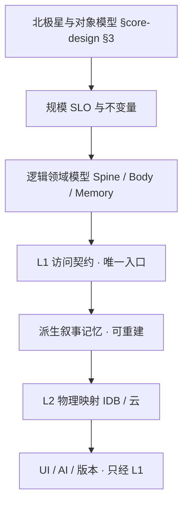
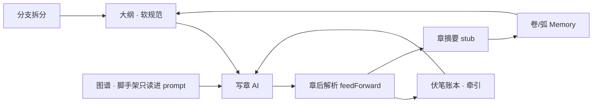

# Story 规模架构（千章级 · 顶层设计）

> **SoT**：本文定义 Story **规模假设、叙事工件分层、访问契约与物理映射原则**。  
> 模块 boot / 写章闭环 / 分支发布见 [`story-studio.md`](./story-studio.md)。  
> 产品对象模型见 [`core-design-philosophy.md`](./core-design-philosophy.md) **§3**（Artifact / Projection / Promotion）。  
> **改规模相关行为前须先读本文**；实现与本文冲突时，改代码或同 PR 修订本文。

---

## 1. 文档定位：顶层设计，不是补丁清单

### 1.1 上一版方案的局限

从 **现状瓶颈**（整部 novel 单 JSON、大纲全量进 prompt、列表全量 DOM）反推出的「分片 + virtualList + 截断 prompt」，在工程上 **方向正确**，但属于 **自下而上（bottom-up）**：

- 先看到 `idbSetJson` / `generateOutline` / `renderViews` 的实现形态，再补存储与 UI；
- **未先定义**「千章级 Narrative Artifact 应有哪些语义层、哪些访问模式、哪些不变量」；
- 风险：只拆 IDB 而不改 **访问契约** 时，版本快照、导出、云同步、Promote 等路径仍会把全书拉回内存，瓶颈 **换位置复发**。

### 1.2 本文方法：自上而下（top-down）

顺序固定为：



**结论**：分片键、virtualList、prompt 截断都是 **L1 契约的必然结果**，不是独立优化项。

---

## 1.3 叙事闭环（产品理念 · 2026-08）

千章架构服务的不是「存得下」，而是 **长篇 AI 创作的可控闭环**：



| 理念 | 含义 | 边界 |
|------|------|------|
| **章节有摘要** | 大纲条、章 stub、`feedForward.summary` 构成摘要金字塔底层 | Spine 常驻；正文在 Body |
| **分卷有总结** | `volumes[]` / `arcSummaries[]`（Memory 派生） | 后台生成；丢失可重建 |
| **分层加载** | Spine + 按需 Body + LRU | L1 契约；见 §5 |
| **图谱指导** | `graphBrief` 进大纲/写章 prompt | **不**随写作自动改 graph |
| **伏笔牵引** | `plotLedger` + feed 解析出的 foreshadows | 状态机：open/planted/paid/dropped |
| **大纲规范执行** | 写章带邻近 `outlineBrief` + 本章摘要 | **软约束**；作者可改纲、开分支 |
| **动态解析** | AI 输出 → `parseOutline` / `parseFeedForward` / `parseQuality` | 结构化沉淀，非裸文本堆叠 |
| **动态更新** | 写章后更新 feed、账本、章 stub；远距靠 Memory | 图谱 **不**自动更新 |
| **分支拆分** | `branches[]` + fork + release 裁剪 + 读者选线 | 与 Spine 正交，共享 Body 键空间 |

**与 Entity 分工**：闭环只动 **Narrative Artifact**；人物/世界 SoT 仍在卡/工坊，经 Promote / `entityRef` 桥接。

---

## 2. 规模目标（SLO · 先定义再设计）

| 维度 | 目标（单部 novel） | 说明 |
|------|-------------------|------|
| 章节规模 | **≥ 1000 章** | 逻辑上仍为 **一部作品**，不默认拆成多部 catalog 项 |
| 总字数 | **≥ 200 万字** | 按章均 2000 字估算；超长单章另计 |
| 打开作品 | 首屏可交互 **< 500ms** | 仅加载 **Spine + 当前章 Body** |
| 切章 | **< 200ms**（热缓存） | 工作集 LRU 3～5 章 |
| 单章保存 | **< 100ms** 增量写 | 不触发全书序列化 |
| 内存工作集 | **与总章数无关** | 禁止 `state.novel` 常驻全书 `content` |
| AI prompt | **有界** | 任意续写/写章 prompt **不随总章数线性增长** |
| 大纲列表滚动 | **60fps 级** | 仅渲染可见窗口（~20 行） |
| 导出全书 | **流式** | 峰值内存不随总字数线性涨 |

**不在 SLO 内（另开议题）**：写作后自动从正文提取 entity 升格（§core-design Phase 2）；Story Ref 实时拉工坊 entity 最新展示。

---

## 3. 从 core-design 推导

### 3.1 Narrative Artifact 不是单一 blob

[`core-design-philosophy.md`](./core-design-philosophy.md) **§3.6** 将 Story 大纲 / 章节树归类为 **Narrative Artifact**（结构，非世界观条目）。  
千章级下须进一步 **内生分层**（逻辑一体、物理可分）：

| 层 | 名称 | 语义 | 体量 | 是否 SoT |
|----|------|------|------|----------|
| **Spine** | 叙事脊骨 | 分支拓扑、`outlineIndex`、章 stub（id/order/title/summary/branchId）、`meta` 计数 | 千章级仍 **小**（MB 级以下） | **是**（结构真相） |
| **Body** | 章节正文 | `content`、`feedForward`、`quality`、`checkpoints`、`sourceMeta`、`advancePrompt` | **大**（随章数线性） | **是**（正文真相） |
| **Memory** | 叙事记忆 | 卷/弧摘要、`arcSummaries`、大纲检索索引、章级 feed 索引 | 中；**可自 Body+Spine 重建** | **派生**（缓存，非第二套正文） |
| **Scaffold** | 叙事脚手架 | `graph`（Ref/Narrative 节点）、`plotLedger` | 小～中 | 脚手架；图谱 **不** 随千章自动膨胀 |

与 **工坊** 对照：工坊对 **原文 Artifact** 做分片扫描 + RAG 索引（[`novel-analysis.md`](./novel-analysis.md) §5 Step 1）；Story 对 **叙事 Artifact** 做 **Spine/Body 分离 + Memory 派生**，哲学同构，对象不同。

### 3.2 与四类对象的关系

| core-design 类型 | Story 千章下的落点 |
|------------------|-------------------|
| **Artifact** | Spine + Body（叙事 SoT）；Memory（派生）；试聊 Episode（归档入口） |
| **Canonical Entity** | **仍在卡/工坊**；Story 仅 `entityRef` / Promote，**不**因千章复制第二套 entity 库 |
| **Projection** | `graph` Ref 节点、release 树读者视图 |
| **Promotion** | seed / sync / 试聊归档 — 行为不变；须走 **L1 写章/写 ledger**，禁止绕过契约直写 monolith |

### 3.3 逻辑作品 vs 物理分片

| 用户心智 | 系统实现 |
|----------|----------|
| 一部 novel、一个 catalog 项、一套分支/release | `novelId` 不变 |
| 写第 800 章与写第 8 章体验一致 | 仅加载 Body(800) + Spine 窗口 + Memory 检索 |
| 导出/发布仍是「这本书」 | 按 order 流式拼接 Body；快照存 spine hash + 按需拷贝 body |

**禁止**：为规模把一部书默认拆成多个 catalog novel（「卷 N」）作为 **架构方案**；仅可作为 Phase 落地前的 **人工权宜**（见 §10）。

---

## 4. 逻辑领域模型

### 4.1 Work（作品根）

```js
// 逻辑根 · Manifest 常驻
{
  id, cardId, title, createdAt, updatedAt,
  storageSchema: 2,        // 规模分层契约版本（≠ release schemaVersion）
  meta: {
    chapterCount, outlineCount,
    contentRev,             // 与云同步对齐
  },
  branches[], activeBranchId,
  volumes[],                // 可选：用户卷界；{ id, title, startOrder, endOrder }
  graph,                    // Scaffold · 规模上保持「脚手架」定位
  plotLedger,
  writeSettings, wizard,
  versions[],               // 版号列表 · 快照策略见 §7
}
```

### 4.2 Spine 条目

**大纲索引**（`outlineIndex[]`，与 `outline[]` 合并语义：Manifest 只存索引级字段）：

```js
{ id, order, title, summary, branchId, volumeId? }
// summary ≤ 200 字 · 供列表与 AI 窗口
```

**章 stub**（`chapters[]` 在 Manifest 中 **仅 stub**）：

```js
{ id, order, title, summary, branchId, contentLen, updatedAt }
// 无 content · 无 feedForward
```

### 4.3 Body 片

独立寻址，按 `chapterId`：

```js
{
  content, advancePrompt,
  feedForward, quality, checkpoints,
  sourceMeta?,
}
```

### 4.4 Memory（派生）

```js
arcSummaries[]   // { id, startOrder, endOrder, summary, generatedAt }
outlineSearch    // 可选：BM25 / 轻量索引 · 仅 outlineIndex 文本
```

重建策略：Body 的 `feedForward` + Spine stub → 可重算 arc；**丢失 Memory 不丢正文**。

---

## 5. L1 访问契约（架构核心）

**所有** UI、写章流水线、大纲生成、导出、版本、Promote、云同步 **必须** 经下列入口，**禁止** 直接假设 `novel.chapters[i].content` 全书可用。

| 入口 | 职责 | 消费者 |
|------|------|--------|
| `loadWorkManifest(cardId, novelId)` | 仅 Spine + 根字段 | 打开书、管理页、catalog |
| `loadChapterBody(cardId, novelId, chapterId)` | 单章 Body | 写作、阅读、导出单片 |
| `saveChapterBody(...)` | 增量写 Body + 更新 stub | 写章流水线、Promote 章草稿 |
| `saveManifest(...)` | debounce 写 Manifest | 大纲编辑、分支、graph |
| `getSpineForBranch(novel, branchId)` | 可见 outline + chapter stubs | 大纲/目录/选章 |
| `assembleOutlineContext({ mode, cursor, direction })` | **有界** 大纲 prompt 包 | `generateOutline` |
| `assembleWriteContext(chapterId)` | 有界写章包 | `writePipeline`（现有 `tokenBudget` 扩展） |
| `exportWorkStream({ branchId, from?, to? })` | AsyncIterable / stream | 导出 TXT |
| `snapshotForVersion({ versionId })` | 不可变快照句柄 | 增版/发布 |

**运行时状态**：

- `state.novel` = Manifest + **ChapterCache**（LRU，非全书 Body）
- `getActiveChapters()` / `getActiveOutline()` **保留活引用语义**，但 `content` 仅在 **已加载** 的章上存在；未加载章读 content 须 **显式** `loadChapterBody`

**normalizeNovel**：仍仅用于 **加载 / 导入 / 迁移边界**；输出 Manifest 形态（stub 章），不内联全书 content。

---

## 6. 有界 AI 上下文（自上而下）

原则：**Cursor 在 Spine 上的位置 + Memory 检索**，而非全书字符串拼接。

### 6.1 大纲续写（`continue`）

`assembleOutlineContext` 固定包：

1. 创作方向 + 分支 hint  
2. **近邻窗口**：当前 cursor 前/后各 **15** 条 `outlineIndex`  
3. **弧记忆**：当前 `volume` 或 `arcSummaries` 中覆盖 cursor 的摘要  
4. **检索补全**（可选）：对 `outlineIndex` 做 BM25，取 **10～20** 条与 direction 相关的历史摘要  
5. **Scaffold 摘要**：`graphBrief`（token 上限沿用现有）  
6. **禁止**：`visible.map(全量 title+summary).join`

首段（`segment`）仍一次生成 8～12 条，不变。

### 6.2 写章

沿用 **`tokenBudget.mjs` 洋葱模型**（近章 feedForward + 账本 + 图谱 brief）。  
扩展点：远章背景走 **Memory**（arc summary / 检索到的 outline 条），不扫描全书 `chapters[]`。

### 6.3 卷/弧摘要（Memory 写入）

| 触发 | 行为 |
|------|------|
| 用户「设为卷末」 | 写 `volumes[]` + 异步任务生成 `arcSummary`（可取消 · 任务中心） |
| 无卷界 | 每 **50** 章自动维护一条 `arcSummaries`（仅后台，不打扰 UI） |

---

## 7. 版本 / 发布 / 云 / 导出

| 能力 | 顶层设计 |
|------|----------|
| **草稿保存** | Manifest debounce + 脏 Body 增量 |
| **增版/发布** | 快照 = Manifest spine 副本 + `{ chapterId → contentHash }`；Body **按需** 拷贝至 `versions/{verId}:ch:{id}`，禁止一次深拷贝千章 |
| **release 树** | 读者视图仍 schema v2；构建时 **流式** 读 Body |
| **导出** | `exportWorkStream` · 按 order 逐章 `loadChapterBody` → Blob stream |
| **云 API** | `GET manifest` + `GET/PUT chapter` 与 [`cloud-sync.md`](../systems/cloud-sync.md) 扩展对齐；**不得** 恢复全书单 JSON 上传 |

Action Engine 互斥语义 **不变**（写章/大纲进行中硬禁切书删书）。

---

## 8. UI 原则（消费 L1）

| 视图 | 约束 |
|------|------|
| 大纲 | `getSpineForBranch` + **virtualList**（复用 `src/lib/ui/virtualList.mjs`） |
| 写作选章 | 搜索 + virtualList，禁止全量 `<option>` |
| 阅读目录 | 同 Spine 虚拟列表；正文单章 Body |
| 管理 | `meta.chapterCount`，不扫 Body |

卷界操作收在大纲行「⋯」；不增加第一视口元数据条（对齐 [`design-system.md`](../ui/design-system.md)）。

---

## 9. L2 物理映射（实现层 · IDB）

逻辑 **一部 novel**；键空间为 L1 的投影：

```
storyStudioV1:card:{cardId}:{novelId}                 → Manifest（Spine + 根）
storyStudioV1:card:{cardId}:{novelId}:ch:{chapterId}  → Body
storyStudioV1:card:{cardId}:{novelId}:arc:{arcId}     → 可选 · 大 arc 摘要外置
```

- catalog 键不变  
- 删书/删章：级联删 `ch:*`  
- **迁移 v1→v2**：monolith 中 `chapters[].content` 拆 Body；写 `storageSchema: 2`；失败保留 `:backup:v1` 直至成功  

模块建议：`storyStorage.mjs`（L1 实现）、`storyMigrate.mjs`、`storyOutlineContext.mjs`（`assembleOutlineContext`）。

---

## 10. 分期交付（每层闭环）

| 阶段 | 状态 |
|------|------|
| **A · L1 存储** | ✅ `storyStorage.mjs`、v1→v2 迁移、lazy/eager |
| **B · 有界大纲** | ✅ `storyOutlineContext.mjs` |
| **C · UI virtualList** | ✅ 大纲 / 阅读目录 / 写作目录（>40 条） |
| **D · 流式导出/版本分片** | ✅ `storyExportStream.mjs`、版本章分片、`exportTxt` 流式 |
| **E · 云 API** | ✅ manifest + `GET/PUT chapter` 分章同步 |
| **Memory 自动生成** | ✅ 卷末按钮 + 每 50 章后台弧摘要 |

依赖：**A → B ∥ C → D → E**（E 可滞后，本地千章不依赖云）。

**落地前权宜**：人工按卷拆多部 novel（每部 ≤150 章）— **非架构**，仅运营建议。

---

## 11. 测试与防护

| 类型 | 内容 |
|------|------|
| 契约 | 任何模块不得 `JSON.stringify` 全书 Body 做常规 save |
| 单测 | `storyStorageV2.test.mjs`：migrate、LRU、assembleOutlineContext 边界 |
| 回归 | 小书（<20 章）v1→v2 后大纲→写→读→发布 |
| 文档 | 本文 + `story-studio.md` 索引 + `core-design-philosophy.md` §3.6.1 |

---

## 12. 自下而上 vs 自上而下（对照）

| 维度 | 自下而上（补丁式） | 自上而下（本文） |
|------|-------------------|------------------|
| 起点 | `idb.mjs` 单键、`writeActions` 全量 outline | Narrative Artifact 三层 + SLO |
| 分片 | 「IDB 太大就拆键」 | Body 层 **本当** 独立寻址；键是 L1 投影 |
| virtualList | 「DOM 太多就虚拟滚动」 | Spine 列表 **本来** 就是窗口化数据源 |
| prompt | 「字符串太长就 slice」 | `assembleOutlineContext` **唯一** 出口；Memory 检索是正规能力 |
| 版本/云 | 容易遗漏 | 快照/导出 **必须** 走 L1 stream |
| 复发风险 | 高 | 低（契约测试兜底） |

---

## 13. 不在本次范围

- 小说管理页卡片化（用户已决：先不做）  
- Story 写作 → entity 自动提取（core-design Phase 2）  
- Story Ref 实时读工坊 entity（§9.1 Phase 2）  
- 写作过程自动更新 graph（产品当前：**否**；千章下仍 **否**）

---

## 14. 实现索引

| 层级 | 路径 |
|------|------|
| L1（目标） | `storyStorage.mjs`、`storyOutlineContext.mjs`、`shared.mjs` |
| 写章 | `writePipeline.mjs`、`writeActions.mjs`、`tokenBudget.mjs` |
| UI | `renderViews.mjs`、`writeBranchUi.mjs`、Story 各 Panel |
| 版本/导出 | `novelVersions.mjs`、`exportTxt.mjs`、`manageActions.mjs` |
| 测试 | `tests/storyStorageV2.test.mjs`、`tests/storyStudio.test.mjs` |
