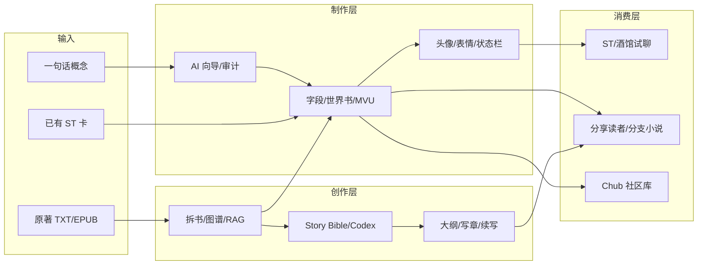

# 竞品调研报告：角色卡 / 小说工坊 / AI 写小说（2026-07）

> 调研目的：为 ST Card Builder 后续产品方向提供外部参照。  
> 范围：ST 生态制卡工具、中文 RP 工作台、小说拆解/工坊、AI 长篇创作、世界观构建、社区分发平台。  
> **非 SoT**——结论随市场变化需定期刷新。

---

## 1. 执行摘要

| 赛道 | 主流形态 | 我们的位置 |
|---|---|---|
| **角色卡制作** | 浏览器零服务器编辑器、ST 插件、桌面一体化锻造炉 | 功能最全之一（卡 + 世界书 + MVU + 状态栏 + 成人层 + 云同步），但 **AI 制卡向导** 与 **质量审计** 弱于 CharCardStudio / CardGenV2 |
| **小说工坊（拆书→制卡）** | 独立拆书/图谱工具（AI-Reader、拆书 Agent） | **差异化明显**：绑卡流水线、RAG、写回 ST 字段；缺 **可视化图谱深度** 与 **拆书报告导出** |
| **小说创作** | BYOK 写作台（Novelcrafter）、闭源 Muse（Sudowrite）、开源多 Agent（MuMu/InkAI） | Story Studio 有分支/图谱/版本/分享；缺 **Codex 式自动 mention**、**Scene Surgery 式精修**、**系列共享世界观** |
| **社区分发** | Chub.ai 角色库 + Lorebook 仓库 | 我们有分享/读者端，但 **无公共发现市场** |

**战略判断**：不要做成「又一个 Sudowrite」或「又一个 Chub」——应强化 **「原著/设定 → 可玩角色卡 → 可分享互动小说」闭环**，这是单一竞品极少覆盖的全链路。

---

## 2. 市场地图

---

## 3. 角色卡制作竞品

### 3.1 ST 生态 · 插件 / 扩展

| 产品 | 形态 | 亮点 | 可借鉴 |
|---|---|---|---|
| [CharCard Studio](https://github.com/MMKAVERAPPA/SillyTavern-CharCardStudio) | ST 全屏扩展，Agent + Tool Calling | **分阶段工作流**（Ideate → Build → Audit → Optimize）；`audit_card` 静态评分；Janitor 模式；Lorebook 规划；**改写字段前先 stage 预览** | 制卡助手改为 **结构化工具链**（写字段 / 写 lore / 审计 / 压 token 分步）；发布前 **自动审计报告** |
| [CREC](https://github.com/bmen25124/SillyTavern-Character-Creator) | ST 扩展，接 Connection Profile | 直接吃 ST 内 LLM 配置；151⭐ 验证需求 | 我们试聊已有 runtime，可 **复用 AI 配置一键填卡** |
| [CardGenV2](https://github.com/zebede1980/CardGenV2) | 独立 Web | **Concise AI-guidance** 原则；Import & Remaster；流式生成+Stop；V2 校验 | **卡质量规范**（短描述+行为 bullet）；**导入旧卡一键 remaster** |

### 3.2 ST 生态 · 浏览器编辑器（隐私优先）

| 产品 | 亮点 | 可借鉴 |
|---|---|---|
| [TavernQuill](https://github.com/hockey323/TavernQuill) | V3 原生、零服务器、**四章节工作流**（Soul/Mind/Voice/Ghost）、导出双 chunk、PWA | **分章向导 UI**；导出 checklist；WCAG |
| [Chara Snap](https://www.charasnap.com/) | 免费、完整 Lorebook CRUD、V2/V3/CHARX | Lorebook **secondary keys / recursive** 编辑体验 |
| [The Grimoire](https://rpfiend.com/grimoire-launch-character-card-editor/) | 浏览器、**未知字段 round-trip 保留**、AI 可选自驱 | 导入兼容策略：**不丢未知 JSON 字段** |
| [Sillycard](https://sillycard.xyz/) | macOS/iOS 原生、PNG 元数据读写、文档型 SEO | 移动端 **只读/轻编辑** 场景 |

### 3.3 中文 · 桌面一体化

| 产品 | 亮点 | 可借鉴 |
|---|---|---|
| [CardForge](https://github.com/Anastasia2372/sillytavern-cardforge) | Electron+Vue；**MVU 13 件套可视化**；EJS/状态栏 iframe 预览；NPC 生成器；正则/助手脚本模板库 | **MVU 向导**与模板市场；状态栏 **iframe 实时预览**（我们已有 statusBar，可加强「一键从变量生成栏」） |
| [游蜂写作](https://www.youfengxiezuo.com/roleplay.html) | 角色+剧情+世界书+群聊+记忆表+语音；**18 种关系预设**；好感度 -100~+100 | **关系/好感变量**与制卡字段联动；「开箱即用」叙事 |

### 3.4 社区与分发

| 平台 | 角色 | 启示 |
|---|---|---|
| [Chub.ai](https://chub.ai) | 角色卡「应用商店」+ Mars 聊天 + Lorebook 仓库 | 分发靠 **路径引用**（`lorebooks/...`）；Characterbook 与卡绑定；我们分享是 **私有 token**，缺 **公开目录/搜索** |
| JanitorAI | 聊天前端 + 上传 Lorebook JSON | Lorebook 格式门槛高；**内置编辑器**降低摩擦 |

### 3.5 资产层（头像/表情）

| 产品 | 说明 |
|---|---|
| [TavernSprite](https://tavernsprite.com) | 单图 → 28 表情 ZIP，解决 RP 沉浸感最大体力活 |

**借鉴**：制卡闭环可接「头像/表情包生成」外链或 API 集成，不必自研模型。

---

## 4. 小说工坊 / 拆书竞品

> 对应我们：`novel/` 流水线（原始资料 → 拆章 → 分析/人物/世界书/文风 → **写回绑卡**）

| 产品 | 形态 | 强项 | 我们差距 |
|---|---|---|---|
| [AI-Reader-V2](https://github.com/nguyen-hung-dev/AI-Reader-V2) | React+FastAPI，本地 SQLite | 关系图/地图/时间线/百科/RAG 问答/设定集导出 | **多维可视化**与实体预扫描 |
| [Graph Every Novel](https://github.com/Renakoni/graph-every-novel) | 桌面，逐章累计 | 关系**稳定图筛选**、支持度量化、可解释 JSON | 图谱 **量化边权重** |
| [novel-analysis-agent](https://github.com/Ce-Legend/novel-analysis-agent) | 拆书报告流水线 | 固定栏目（大纲/CP/文笔/小传）→ MD/DOCX/PDF + **质量门禁** | **报告导出**与模块质检 |
| [Silverfish 衣鱼](https://github.com/xumengke2025-sys/silverfish) | 3D 关系图 | 证据下钻、读者向追问提示 | 分析结果 **证据片段 UI** |
| [novel-graphrag](https://github.com/yekup/novel-graphrag) | GraphRAG + 多 Agent | Wiki 编译、三级检索、MCP 暴露 | RAG **问答面板**、Agent 编排 |

**我们的独特价值**：竞品几乎都不 **export 到 SillyTavern 世界书 + 卡字段**；「拆书」是终点，我们是 **制卡中间站**。

**建议补齐**：
1. 分析页增加 **关系图/时间线只读视图**（复用 Story Studio 的 G6）
2. **拆书摘要导出**（MD/PDF，给作者自用，不写进卡包）
3. 章节分析 **失败重试 + 质量评分**（参考 novel-analysis-agent）
4. RAG 面板：**「问这本书」** 与制卡字段互链（选中答案一键写入 worldbook）

---

## 5. AI 写小说 / 长篇创作竞品

> 对应我们：`storyStudio/`（图谱/大纲/写作/分支/版本/分享）

### 5.1 国际 · 商业写作台

| 产品 | 模型 | 核心设计 | 可借鉴 |
|---|---|---|---|
| [Sudowrite](https://sudowrite.com) | 闭源 Muse + 多模型 | **Story Bible 链式生成**（Braindump→Synopsis→…→Scenes）；Write 读 **20k 词 + 25 章链接**；Describe/Rewrite；Series Folder | **章节链式上下文**；圣经 **分层互相引用**；Auto/Guided/Tone 三模式 |
| [Novelcrafter](https://www.novelcrafter.com) | BYOK | **Codex** wiki + **Progressions**（角色/世界随时间变化）+ mention 自动跟踪 + **AI Context 四级策略** | 实体 **别名/plural/排除词**；「检测到才注入」降 token |
| [PlotForge](https://plotforge.app) | _workspace_ | **Scene Surgery** 目标化改稿（diff 接受/拒绝）；连续性一体 | 写作页 **beat 级 surgical edit** |
| [Author's Workshop](https://authorsworkshop.org) | 桌面 | **World Bucket** + 关键词触发；Importer 从章节抽实体 | 从正文 **反向抽 Codex** |
| [ProseEngine Story Codex](https://proseengine.app/story-codex) | BYOK | 关系 force graph、**场景共现自动建边**、AI 一键补全条目 | **共现检测**代替手工连边 |

### 5.2 中文 · 网文 / 开源

| 产品 | 亮点 | 可借鉴 |
|---|---|---|
| [MuMuAINovel](https://github.com/xiamuceer-j/MuMuAINovel) | 2k⭐；向导建项；关系/组织可视化；**伏笔管理**；提示词工坊社区；Docker 多用户 | **伏笔时间线**（我们 plotLedger 可产品化）；Prompt 模板市场 |
| [InkAI](https://github.com/inier/InkAI) | 7 Agent 流水线；Big Five 人物；三幕剧；**5 维质量评估** | 写章后 **自动质检维度**（连贯/人物/节奏/文笔/伏笔） |
| [橙瓜码字](https://mz.chenggua.com/) | 网文垂直；拼字/战队/统计；AI 续写 Freemium | **码字节奏/统计**（作者粘性，非核心） |
| [作家助手](https://zuojia.write.qq.com/) | 阅文生态；多端同步；版本冲突提醒 | 冲突 UI 我们已在 syncCenter 起步，可加强 **版本树对比** |

### 5.3 世界观构建（非 AI 为主）

| 产品 | 适合谁 | 启示 |
|---|---|---|
| [World Anvil](https://www.worldanvil.com) | GM、百科型世界观 | 模板化条目、时间线、互动地图 |
| [Campfire Writing](https://campfirewriting.com) | 小说家模块化 | 地图/语言/魔法模块 **按需购买** → 我们可用 **功能开关/配额档位** 表达 |

---

## 6. 与 ST Card Builder 对照

### 6.1 已有优势（相对竞品）

| 能力 | 说明 |
|---|---|
| **三模块一体** | 制卡 + 小说工坊（绑卡）+ Story Studio（独立创作）+ 右栏助手 |
| **ST 深度** | 世界书、正则、TH 脚本、MVU、状态栏、extensions、V 版号 |
| **成人向配置** | NSFW/NTL/恶堕目录与侧栏入口（竞品多回避或散落） |
| **云 + 分享 + 配额** | 登录同步、冲突摘要、发布门禁、读者分享、导出、设备 Bearer |
| **版本模型** | 卡/小说统一「单草稿 + versions[] 不可变已发」 |

### 6.2 主要差距

| 差距 | 竞品参照 | 优先级建议 |
|---|---|---|
| 制卡 **AI 审计 / remaster / token 优化** | CharCard Studio, CardGenV2 | **P0** — 直接提升卡质量与完成率 |
| **Codex 式实体库**（跨卡/跨 Story 共享） | Novelcrafter, Sudowrite Series | **P1** — 系列作者刚需 |
| 小说工坊 **可视化与报告** | AI-Reader, novel-analysis-agent | **P1** — 降低拆书信任成本 |
| 写作 **scene 级 diff 精修** | PlotForge Scene Surgery | **P1** — 比整章重生成更实用 |
| **伏笔/进度可视化** | MuMuAINovel, InkAI 质检 | **P2** |
| 社区 **公开发现**（非仅 token 分享） | Chub | **P2** — 涉合规与运营，可先做「作者公开页」 |
| 移动端 / PWA 离线 | TavernQuill, Sillycard | **P3** |
| 表情/立绘包 | TavernSprite | **P3** — 集成优于自研 |

---

## 7. 可借鉴的设计模式（跨品类）

### 7.1 工作流分阶段 + 可审计

CharCard Studio 的 **Ideate → Build → Audit → Optimize** 与 Sudowrite 的 **Braindump → … → Scenes** 共同点：**每步产出可 review，再进入下一步**。  
→ 我们 `cardJourney` / `publishWizard` 可扩展为 **带检查点的向导**（字段完整度、worldbook 条数、contentRev、配额、审计分）。

### 7.2 结构化上下文注入，而非整包粘贴

Novelcrafter Codex 的 **Include when detected / Never include** 与 Sudowrite「仅显式提到的角色进入生成」→ 降低 token、减少 hallucination。  
→ Story 写章、工坊分析、助手工具应统一 **「按需注入实体」** 层（可复用 RAG + 图谱节点选中）。

### 7.3 质量门禁嵌入流水线

novel-analysis-agent 的 **导出前质检**；CardGenV2 的 **concise standard**；InkAI 的 **5 维评分**。  
→ 发布/分享/上云前已有 publishGate，可增加 **软评分 + 改进建议**（不阻断但引导）。

### 7.4 证据可追溯

Silverfish / Graph Every Novel 的 **关系边附原文证据**。  
→ 工坊分析、助手改字段时展示 **「依据哪一段原文」**，提高作者信任。

### 7.5 BYOK + 本地优先选项

TavernQuill、CardForge、Author's Workshop 强调 **数据不出机**。  
→ 我们已是静态 SPA + 可选云；可强化叙事：**「默认本地，云为备份与分享」**（与 SecurityCordon 一致）。

### 7.6 模块化和配额

Campfire 按模块购买；我们已有 quota tier → 可将 **Story 部数 / 分析字数 / 分享数 / 设备数** 与 **会员档** 对齐 storytelling。

---

## 8. 发展路线建议（12–18 个月）

### 8.1 短期（0–3 月）— 夯实「制卡完成率」

1. **卡审计助手**：静态检查（字段长度、重复、worldbook 冲突、token 估算）+ 可选 AI remaster（CardGenV2 式）
2. **完善 cardJourney / publishWizard UI**：CharCard Studio 式分步 + 发布前 checklist
3. **工坊分析增强**：章节失败重试；关系图只读；导出 Markdown 摘要
4. **冲突合并 UI**（路线图已有）— 参照作家助手「冲突智能提醒」

### 8.2 中期（3–9 月）— 打通「拆书 → 卡 → 故事」

1. **共享 Codex**：绑卡实体 + Story 人物/地点统一 ID；跨项目引用（Novelcrafter series 式）
2. **Story 写章 Scene Surgery**：选中段落 → 目标（收紧/加强动机/改 POV）→ diff 接受
3. **RAG 问答面板**（工坊 + Story）：三级检索（摘要 → 图谱 → 原文）
4. **伏笔/plotLedger 可视化时间线**（MuMu 式）
5. **InkAI 式写后质检**：连贯性、人物 OOC、未回收伏笔

### 8.3 长期（9–18 月）— 生态与差异化

1. **作者公开页**：精选分享 + 可 fork 卡（类 Chub 但 ST 原生 + 世界书完整）
2. **提示词/模板市场**：社区上传 MVU 套件、状态栏、工坊 prompt（MuMu 提示词工坊）
3. **可选集成**：TavernSprite 表情包、外部 OCR/EPUB 增强
4. **插件 API**：Discord 已有 Bearer；开放 **「从 Story 导出角色卡」** 给第三方 RP 前端

### 8.4 明确不建议

| 方向 | 原因 |
|---|---|
| 自研大模型 / 闭源 Muse 对标 | 成本高，与 BYOK 用户群冲突 |
| 做全功能 Chub 社区 | 审核、版权、NSFW 合规重；先做作者私有分享更稳 |
| 复制橙瓜拼字/社交 | 与核心 ST/RP 用户画像偏离 |
| 重客户端 Electron | 维护成本高；PWA + 静态站更契合现有架构 |

---

## 9. 定位一句话（对内）

> **「把一本书或一个念头，做成可在 SillyTavern 里玩、并可分支分享给读者的互动作品」**  
> — 比 Chara Snap 多 AI 流水线与云；比 Sudowrite 多 ST 卡与 RP；比 CardForge 多小说工坊与 Story；比 MuMu 多 ST 生态出口。

---

## 10. 参考链接

### 角色卡 / ST
- CharCard Studio: https://github.com/MMKAVERAPPA/SillyTavern-CharCardStudio  
- CardForge: https://github.com/Anastasia2372/sillytavern-cardforge  
- CREC: https://github.com/bmen25124/SillyTavern-Character-Creator  
- CardGenV2: https://github.com/zebede1980/CardGenV2  
- TavernQuill: https://github.com/hockey323/TavernQuill  
- Chara Snap: https://www.charasnap.com/  
- The Grimoire: https://rpfiend.com/grimoire-launch-character-card-editor/  
- Sillycard: https://sillycard.xyz/  
- 游蜂写作: https://www.youfengxiezuo.com/roleplay.html  
- Chub 文档: https://docs.chub.ai/docs/advanced-setups/lorebooks  

### 拆书 / 分析
- AI-Reader-V2: https://github.com/nguyen-hung-dev/AI-Reader-V2  
- Graph Every Novel: https://github.com/Renakoni/graph-every-novel  
- novel-analysis-agent: https://github.com/Ce-Legend/novel-analysis-agent  
- novel-graphrag: https://github.com/yekup/novel-graphrag  

### 写小说
- Sudowrite: https://sudowrite.com  
- Novelcrafter: https://www.novelcrafter.com  
- PlotForge: https://plotforge.app  
- Author's Workshop: https://authorsworkshop.org  
- MuMuAINovel: https://github.com/xiamuceer-j/MuMuAINovel  
- InkAI: https://github.com/inier/InkAI  

### 世界观
- World Anvil: https://www.worldanvil.com  
- Campfire: https://campfirewriting.com  

---

*调研日期：2026-07-23。下次建议刷新：2026-Q4 或 ST V3/CHARX 生态有重大变化时。*
