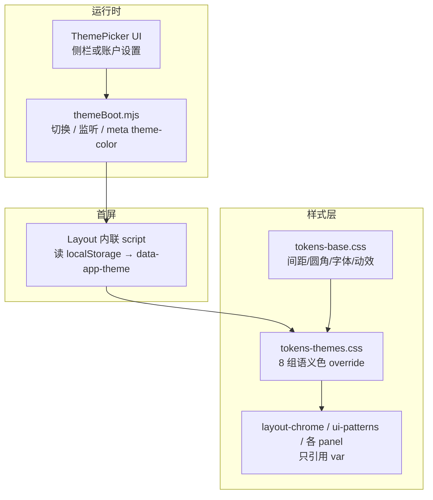

# 全站主题换肤方案（8 套内置皮肤）

> 状态：**已实施**（Phase A+B）。与状态栏 30 套预览主题分层独立。  
> **与状态栏 30 套预览主题分层独立**——本文只覆盖壳层（三栏 / 面板 / 助手 / 试聊等）。

---

## 1. 目标

| 项 | 说明 |
|---|---|
| 用户可切换 | 8 套内置皮肤，一键切换、即时预览 |
| 零 FOUC | 首屏即正确主题，无闪白/闪紫 |
| 不破坏契约 | 组件仍只引用 `var(--*)`；`designTokens.test.mjs` 扩展而非推翻 |
| 范围 | 主站 + 管理端（共用 `Layout.astro`）；**不含** `statusBarThemes/` |
| 持久化 | 默认 `localStorage`；二期可选写入云端 `prefs.appTheme` |

---

## 2. 架构总览



**核心机制**：在 `<html>` 上挂 `data-app-theme="{id}"`，每套皮肤是一个 CSS 选择器块，**完整覆盖语义色 token**（约 35–40 个），不动 `--space-*` / `--radius-*` / `--font-*`。

```html
<html lang="zh-CN" data-app-theme="nocturne">
```

```css
/* tokens-themes.css 片段 */
:root,
[data-app-theme="nocturne"] {
  --color-paper: oklch(19% 0.016 285);
  --color-accent: oklch(76% 0.095 310);
  /* …其余语义 token = 当前 tokens.css 默认值 */
}

[data-app-theme="ink"] {
  --color-paper: oklch(18% 0.02 55);
  --color-accent: oklch(72% 0.08 75);
  /* … */
}
```

---

## 3. 八套内置皮肤定义

命名：**「X庭」+ 英文 id**，与现有「夜庭 Nocturne Atelier」体系一致。7 深色 + 1 浅色（无障碍/白天场景）。

| id | 中文名 | 气质 | 纸色 hue | Accent hue | 特点 |
|---|---|---|---|---|---|
| `nocturne` | **夜庭** | 默认 · 雾紫玫瑰 | 285 | 310 | 现有 baseline，双层紫靛光晕 |
| `ink` | **墨庭** | 暖墨纸、书房金 | 55 | 75 | 低饱和琥珀 accent；偏木质/图书馆 |
| `frost` | **霜庭** | 冷青玻璃 | 240 | 220 | 青蓝 accent；高透明玻璃感 |
| `jade` | **竹庭** | 仙侠青玉 | 165 | 155 | 竹青 accent；可对照状态栏 xianxia 族 |
| `rose` | **玫庭** | 浪漫柔粉 | 320 | 350 | 玫瑰粉 accent；略暖、低攻击性 |
| `neon` | **霓虹庭** | 赛博 lounge | 280 | 300 | chroma 略高、对比更强；仍控在可读范围 |
| `slate` | **岩庭** | 中性专业 | 260 | 250 | 低 chroma 灰蓝；几乎无光晕，偏「工具感」 |
| `daybreak` | **昼庭** | 浅色日间 | — | 285 | **唯一浅色**：浅纸 + 深字；玻璃改为实底 |

> 每套需定义完整 token 集（见 §5），并各配 `--color-paper-glow-a/b` 供 `body` 背景光晕使用，避免 `layout-chrome.css` 写死 oklch。

**默认**：`nocturne`（与现网一致）。**非法/缺失 id** 回退 `nocturne`。

---

## 4. 文件结构（建议）

```
src/styles/
├── tokens-base.css          # 间距、圆角、字体、动效、prefers-reduced-transparency
├── tokens-themes.css        # 8 套 [data-app-theme] 语义色 + :root 默认
├── tokens.css               # @import base + themes（兼容旧引用路径）
├── ui-patterns.css          # 不变，继续 var(--*)
├── layout-chrome.css        # 光晕改 var(--color-paper-glow-*); 清硬编码 oklch
└── …各 panel css            # 分期审计硬编码色

src/lib/theme/
├── themeCatalog.mjs         # 8 套元数据 { id, label, blurb, accentSample, mode: dark|light }
├── themeBoot.mjs              # applyTheme(id), getTheme(), initTheme()
└── themePicker.mjs            # 渲染 swatch 网格 + 绑定事件（可选）

src/components/ThemePicker.astro   # 或嵌入 AppSidebar 底栏 / AccountSyncPanel
```

**Layout.astro 变更要点**：

1. `<head>` 最前增加 **inline script**（≤15 行）：读 `localStorage.getItem('st_v3_app_theme')` → `document.documentElement.setAttribute('data-app-theme', id)`。
2. 可选：`<meta name="theme-color">` 由 `themeBoot` 按 `--color-paper` 更新（PWA/移动端地址栏）。
3. body 末尾 `initTheme()`（与 `chromeBoot` 并列）。

---

## 5. 必须覆盖的语义 token 清单

每套皮肤 **全部赋值**（从现有 `tokens.css` 复制结构后改色）：

**表面**
- `--color-paper`, `--color-paper-deep`, `--color-paper-glow-a`, `--color-paper-glow-b`
- `--color-surface`, `--color-surface-elevated`, `--color-surface-input`, `--color-surface-inset`
- `--color-glass`, `--color-glass-border`, `--color-glass-highlight`

**文本**
- `--color-text`, `--color-text-secondary`, `--color-text-muted`, `--color-text-label`

**Accent 族**
- `--color-accent`, `--color-accent-hover`, `--color-accent-strong`, `--color-accent-soft`, `--color-accent-border`, `--color-accent-glow`, `--color-on-accent`

**边框 / 焦点**
- `--color-border`, `--color-border-subtle`, `--color-focus-ring`

**语义**
- `--color-success*`, `--color-warning*`, `--color-danger*`, `--color-ai-gold*`

**对话 / 组件**
- `--color-msg-user-bg/border`, `--color-msg-char-bg/border`
- `--color-chip-bg/border`, `--color-slider-track`, `--color-overlay`
- `--color-syntax-key/string/number/bool/null`
- `--shadow-panel`, `--shadow-panel-hover`, `--shadow-inset`

**昼庭 light 模式注意**：`--color-text` 与 `--color-paper` 对比度 ≥ WCAG AA（正文 4.5:1）；`--color-glass` 在 `prefers-reduced-transparency` 下本就会降级为实底。

---

## 6. UI：主题选择器

**入口（推荐）**：侧栏底部「配置」区上方增加 **「外观」** 折叠块；或账户页「同步中心」旁独立卡片。管理端同 Layout，自动生效。

**交互**

```
┌─ 外观 ─────────────────────┐
│  ○ ○ ○ ○                   │  4×2 swatch 网格
│  ○ ○ ○ ○                   │  每格：accent 色圆 + 名称
│  当前：夜庭 · 雾紫玻璃      │  `.ui-panel-lead` 级说明
└────────────────────────────┘
```

- 组件类：复用 `.ui-pill-btn` / 新建 `.theme-swatch`（选中：`aria-pressed="true"` + accent 描边）。
- 切换：`applyTheme(id)` → 写 `data-app-theme` + `localStorage` + `CustomEvent('app-theme-changed')`。
- **不做**整页 reload。
- `prefers-reduced-motion: reduce` 下禁用 swatch 缩放动画。

**可选增强（非 MVP）**：跟随系统 `prefers-color-scheme` 自动选 `daybreak` / 默认深色（需「跟随系统」第四态，易混淆，建议 v2 再做）。

---

## 7. 硬编码色清理（实施顺序）

当前 `src/styles/` 内仍有 scattered `oklch()`（layout-chrome ~18、assistant-panel ~34 等）。换肤前须：

| 阶段 | 动作 |
|---|---|
| P0 | `body` 光晕、`layout-chrome` 侧栏/抽屉遮罩 → 改 token |
| P1 | `assistant-panel.css`、`card-manager-panel.css` 高频硬编码 |
| P2 | `auth-login.css` 登录ambient（可与 `--color-paper-glow-*` 共用） |
| P3 | G6 图谱 `theme: 'dark'`（`graphViz.mjs`）→ 读 `data-app-theme` 或固定 dark 子集 |

**原则**：新 PR 禁止在 panel css 新增裸 hex/oklch；CI 可加 grep 门禁（允许 `tokens-themes.css`）。

---

## 8. 持久化与云同步

| 层 | key / 字段 | 说明 |
|---|---|---|
| 本地 | `st_v3_app_theme` | string，8 id 之一 |
| 云端（二期） | `prefs.appTheme` | 登录后 pull 覆盖本地；冲突以 **用户最后一次在 UI 的选择** 为准 |

未登录用户仅本地；与 AI 密钥、草稿无关。

---

## 9. 测试

扩展 `tests/designTokens.test.mjs`：

1. `tokens-themes.css` 存在，8 个 `[data-app-theme="…"]` 块齐全。
2. 每块含 `REQUIRED_TOKENS` 全部变量（复用现有列表 + glow token）。
3. `themeCatalog.mjs` 与 CSS id 一一对应。
4. `Layout.astro` 含防 FOUC inline script。

可选：轻量脚本算 `daybreak` 对比度；或 Playwright 快照 8 主题（成本高，后补）。

---

## 10. 实施分期

### Phase A — 基建（1 PR）

- 拆分 `tokens-base.css` / `tokens-themes.css`
- 仅迁移 `nocturne`（视觉无变化）
- FOUC inline script + `themeBoot.mjs`
- 清 `layout-chrome` 光晕硬编码

### Phase B — 8 套色板 + 选择器（1 PR）

- 补全 7 套深色 + `daybreak`
- `ThemePicker` UI + 侧栏入口
- 扩展 design token 测试

### Phase C — 扫尾（可并行小 PR）

- 各 panel css 硬编码审计
- G6 / 登录页 / meta theme-color
- 文档：`design-system.md` 增「壳层主题」节；声明与 statusBar 分层

### Phase D — 云同步（可选）

- `prefs.appTheme` 读写；账户页说明

---

## 11. 明确不做

| 不做 | 原因 |
|---|---|
| 用户自定义 HEX | 维护/对比度/测试爆炸；8 套 curated 足够 |
| 状态栏主题与壳层联动 | 两套系统职责不同；最多文档提示「推荐搭配」 |
| 每主题单独 CSS 文件按需加载 | Astro 静态打包，全量 ~8KB 可接受，避免闪加载 |
| 管理端独立主题 | 同 Layout，一套即可 |

---

## 12. 与状态栏 30 套的关系

| | 壳层 8 主题 | 状态栏 30 设计 |
|---|---|---|
| 作用域 | 全站 chrome | 卡内 HTML 状态栏预览/导出 |
| 存储 | `st_v3_app_theme` | 卡字段 / MVU 配置 |
| 实现 | CSS 变量 | JS render + 独立 css() |

将来可在状态栏面板加一句：「导出状态栏与侧栏外观无关」。

---

## 13. 验收标准

- [ ] 8 套皮肤均可切换，刷新后保持
- [ ] 首屏无 FOUC
- [ ] `npm test` design token 契约通过
- [ ] 主路径面板（卡管理、助手、试聊、小说工坊、Story）无明显「漏色」块
- [ ] `daybreak` 正文对比度达标
- [ ] `prefers-reduced-motion` / `prefers-reduced-transparency` 仍生效

---

*方案版本：2026-07-23*
